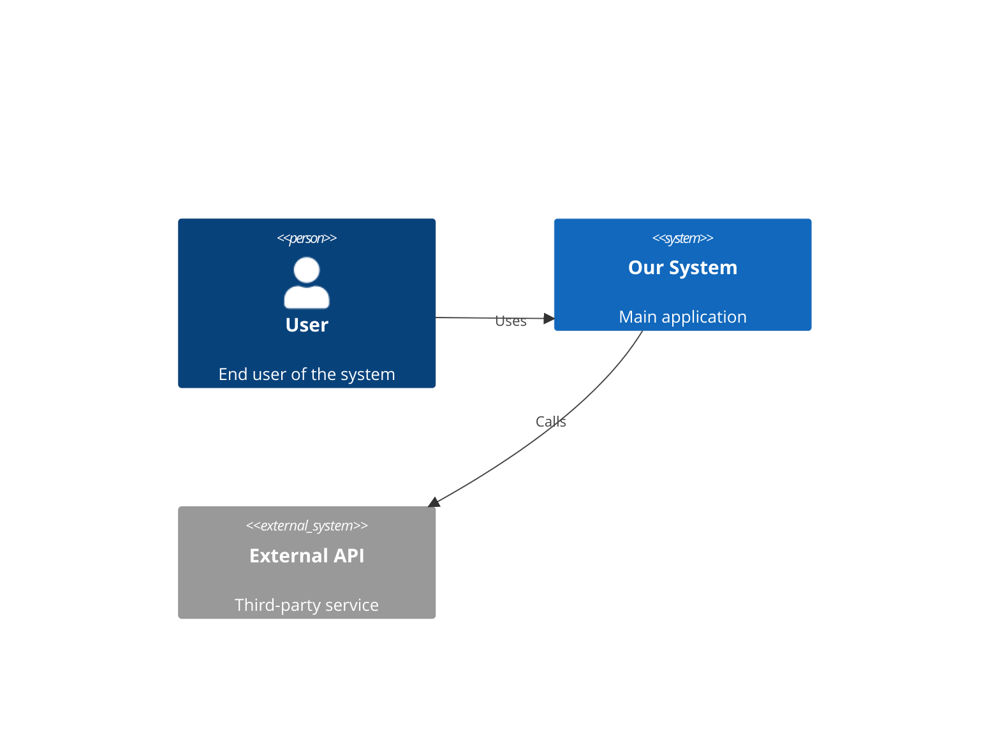
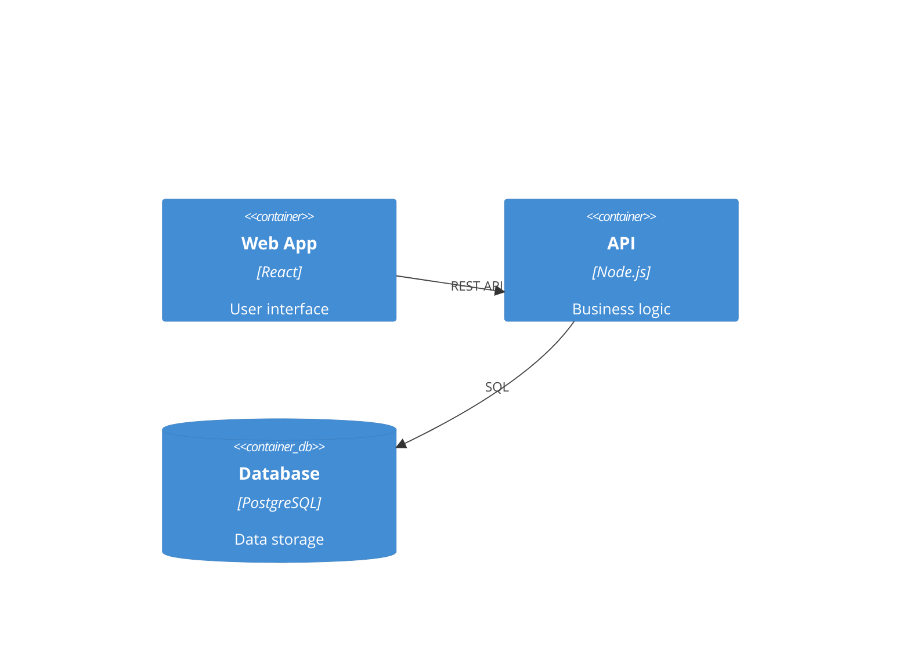

# C4 Architecture Documentation

Generate comprehensive C4 architecture documentation using bottom-up analysis.

## Requirements

Document architecture for: **$ARGUMENTS**

## C4 Model Levels

### Level 1: System Context
- System overview for non-technical stakeholders
- Users and external systems
- High-level relationships

### Level 2: Container
- Applications, data stores, microservices
- Technology choices
- Inter-container communication

### Level 3: Component
- Components within each container
- Responsibilities and interfaces
- Internal dependencies

### Level 4: Code
- Classes, functions, modules
- Detailed implementation structure

## Workflow

### Phase 1: Code-Level (Bottom-Up)

For each directory, document:
- Name and description
- Primary language
- Functions with signatures
- Dependencies (internal/external)
- Relationships (Mermaid diagram)

Output: `C4-Documentation/c4-code-{directory}.md`

### Phase 2: Component Synthesis

Group code into logical components:
- Domain boundaries
- Technical boundaries
- Organizational boundaries

For each component, document:
- Overview and purpose
- Software features
- Interfaces (REST, GraphQL, Events)
- Dependencies

Output: `C4-Documentation/c4-component-{name}.md`

### Phase 3: Container Mapping

Map components to deployment units:
- Container name and type
- Technology stack
- Deployment method
- API specifications (OpenAPI)
- Infrastructure requirements

Output: `C4-Documentation/c4-container.md`

### Phase 4: Context Documentation

Create high-level system context:
- System overview
- Personas (human and programmatic users)
- User journeys for key features
- External dependencies
- Context diagram

Output: `C4-Documentation/c4-context.md`

## Output Structure

```
C4-Documentation/
├── c4-code-*.md           # Code-level docs
├── c4-component-*.md      # Component docs
├── c4-component.md        # Component index
├── c4-container.md        # Container docs
├── c4-context.md          # Context docs
└── apis/
    └── {container}-api.yaml
```

## Mermaid Diagrams

### Context Diagram


### Container Diagram


## Success Criteria

- Every subdirectory has code-level documentation
- Components have interface documentation
- Containers map to actual deployment units
- API specifications are complete
- Context includes all personas and journeys
