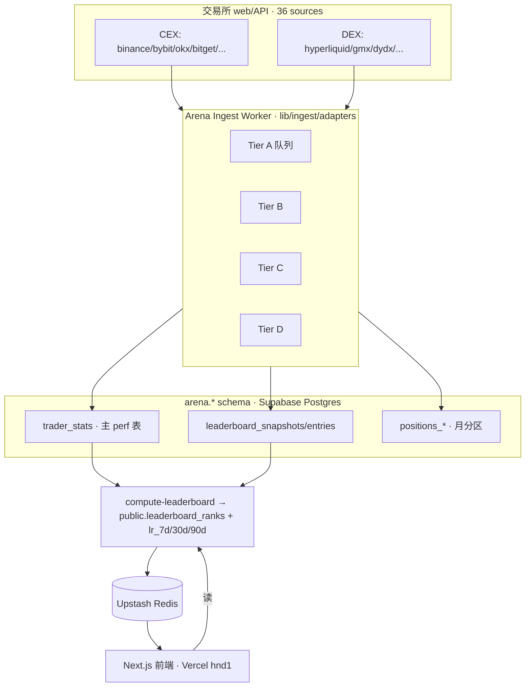
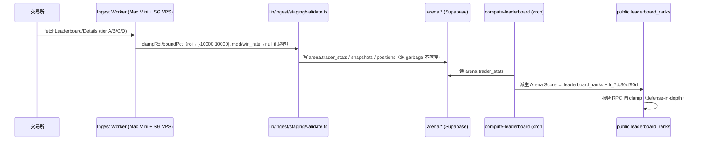
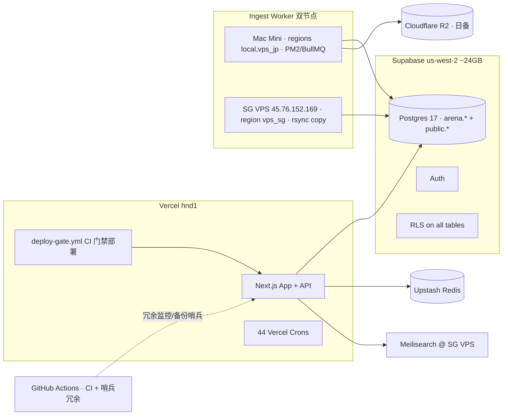
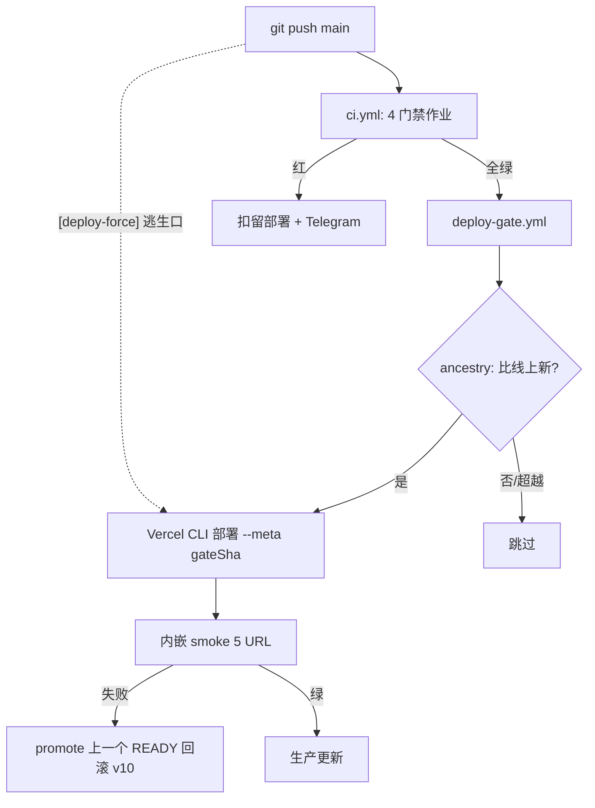

# Arena 架构（数据流 + 拓扑）

> 2026-07-02 首版（Phase 2 知识文档化）。之前审计指出全项目无架构图——本文补上。
> 与 `docs/system-principles.md`（设计原则）、`docs/INGEST_WORKER_TOPOLOGY.md`（worker 节点）、
> `docs/DECISIONS.md`（为什么这么做）配套。数值以 `memory/MEMORY.md` 的实测为准。

## 一、系统全景



## 二、数据管道（写路径）



**关键约束**：指标净化在 **staging 边界**（`lib/ingest/staging/validate.ts`）——
源返回的 garbage（mdd 140665%、kucoin roi 2.19e9）永不落库；服务 RPC
（`arena_core_modules`/`arena_first_screen`）再 clamp 一次。详见 DECISIONS ADR-004。

## 三、Arena Score 公式

```
ReturnScore = 60 * tanh(coeff * ROI)^exponent        (0-60)
PnlScore    = 40 * tanh(coeff * ln(1 + PnL/base))     (0-40)
Arena Score = (ReturnScore + PnlScore) * confidenceMultiplier * trustWeight
Overall     = 90D×0.70 + 30D×0.25 + 7D×0.05
```

系数随周期变（`lib/utils/arena-score.ts`）。

## 四、基础设施拓扑



**单点提示（差距 #2，见 `docs/PHASE2_INFRA_PLAN.md`）**：Mac Mini（运维+备份编排+
phemex 抓取）、SG/JP VPS（scraper/proxy/Meilisearch）仍是单点；抓取类因住宅 IP
反封锁**必须**留本地。监控/告警已有 GH Actions 冗余（`health-monitor.yml` +
`openclaw-sentinels.yml`，2026-07-02）。

## 五、部署与质量门禁流



详见 DECISIONS ADR-011 + `docs/RUNBOOK.md` 部署管线。

## 六、关键文件索引

| 层                 | 位置                                                                                    |
| ------------------ | --------------------------------------------------------------------------------------- |
| Ingest adapters    | `lib/ingest/adapters/<source>/`（NOT lib/connectors）                                   |
| Ingest worker 入口 | `worker/src/ingest-worker.ts`（tier A/B/C/D）                                           |
| 指标净化           | `lib/ingest/staging/validate.ts` + `lib/pipeline/validate-before-write.ts`              |
| 主 perf 表         | `arena.trader_stats`（trader_latest/v2 已 DROP 2026-06-16）                             |
| 服务层             | `public.leaderboard_ranks` + `lr_7d/30d/90d`                                            |
| Arena Score        | `lib/utils/arena-score.ts`                                                              |
| 缓存预设           | `lib/hooks/cache-presets.ts`                                                            |
| Auth 原语          | `lib/api/with-cron.ts`/`with-admin-auth.ts`/`auth.ts`/`lib/auth/`                       |
| 数据获取           | Server `lib/data/*`；Client `lib/hooks/use*`（React Query）；Cache `lib/cache/redis.ts` |
