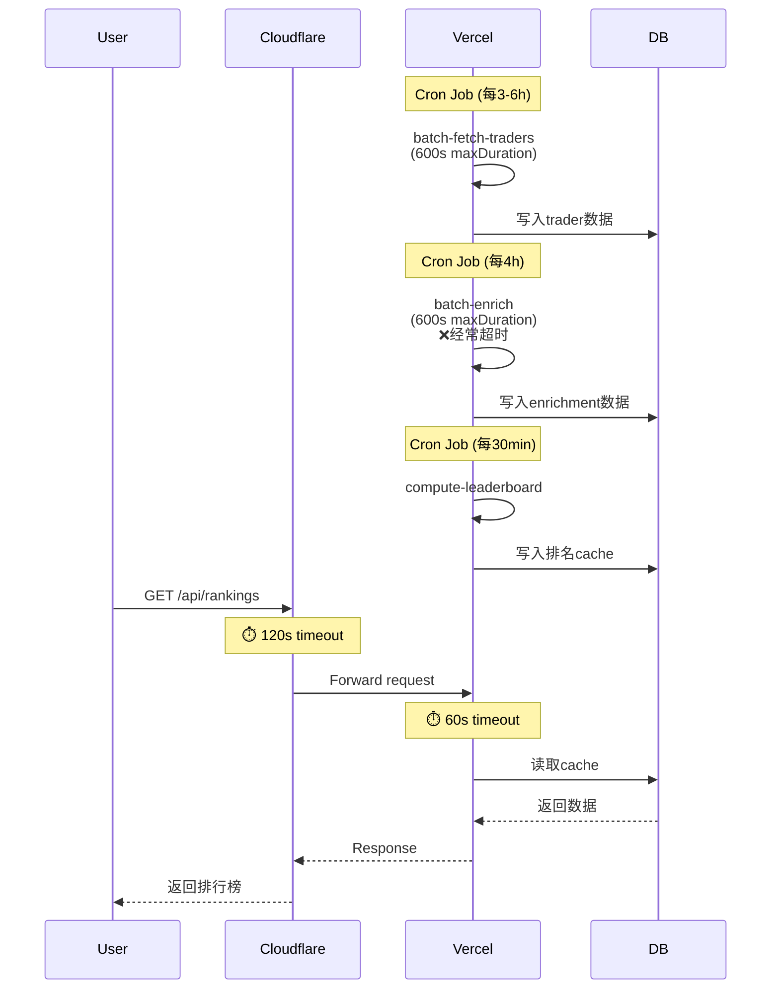
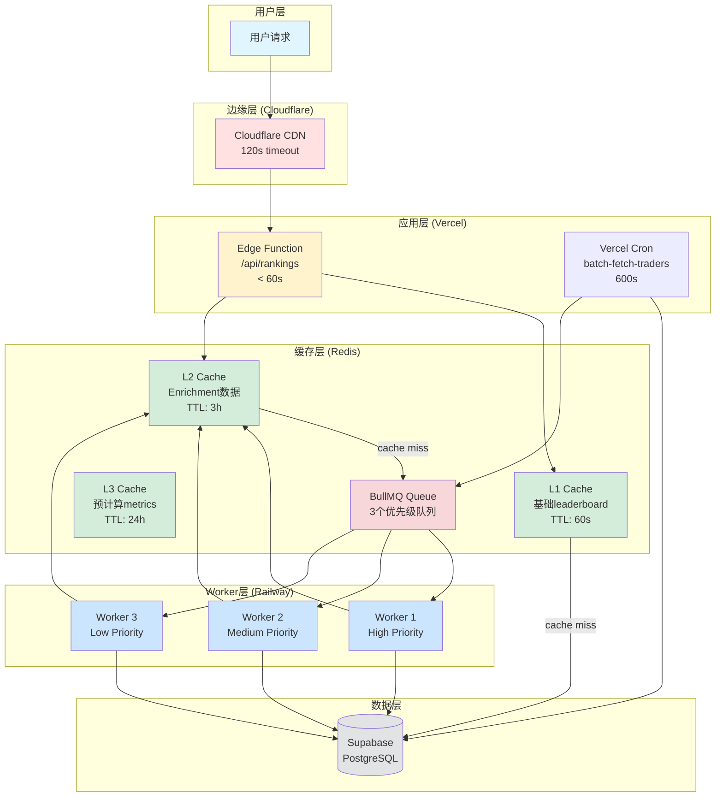
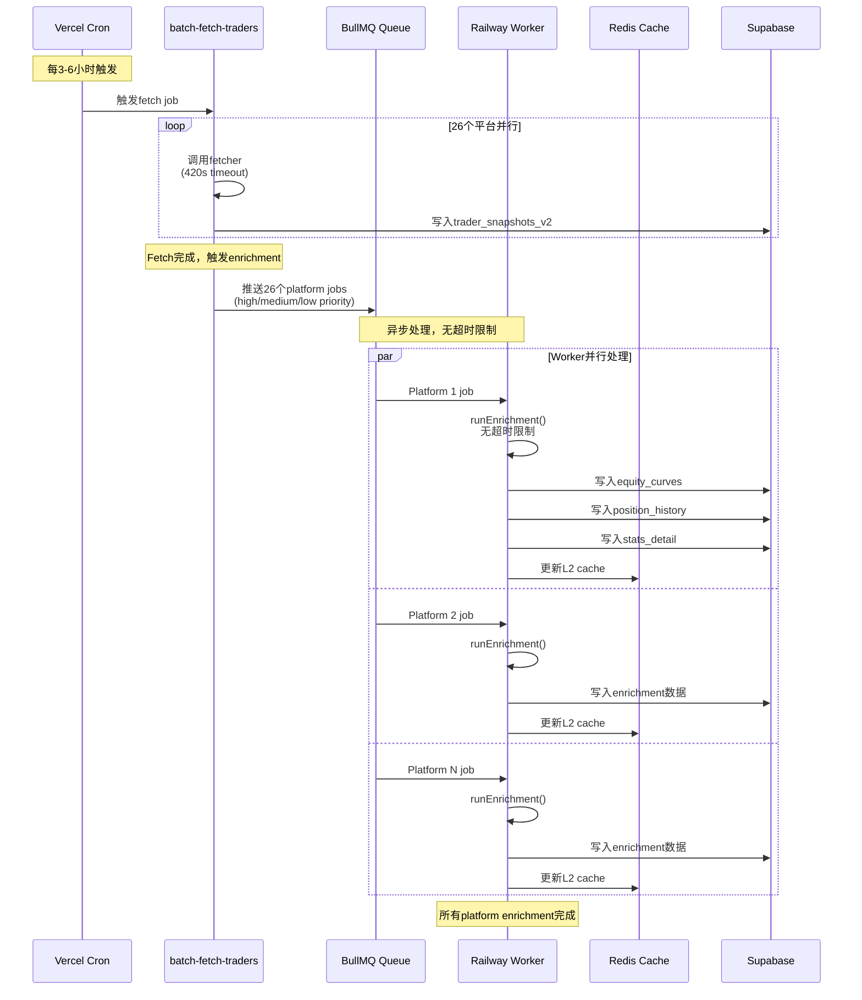
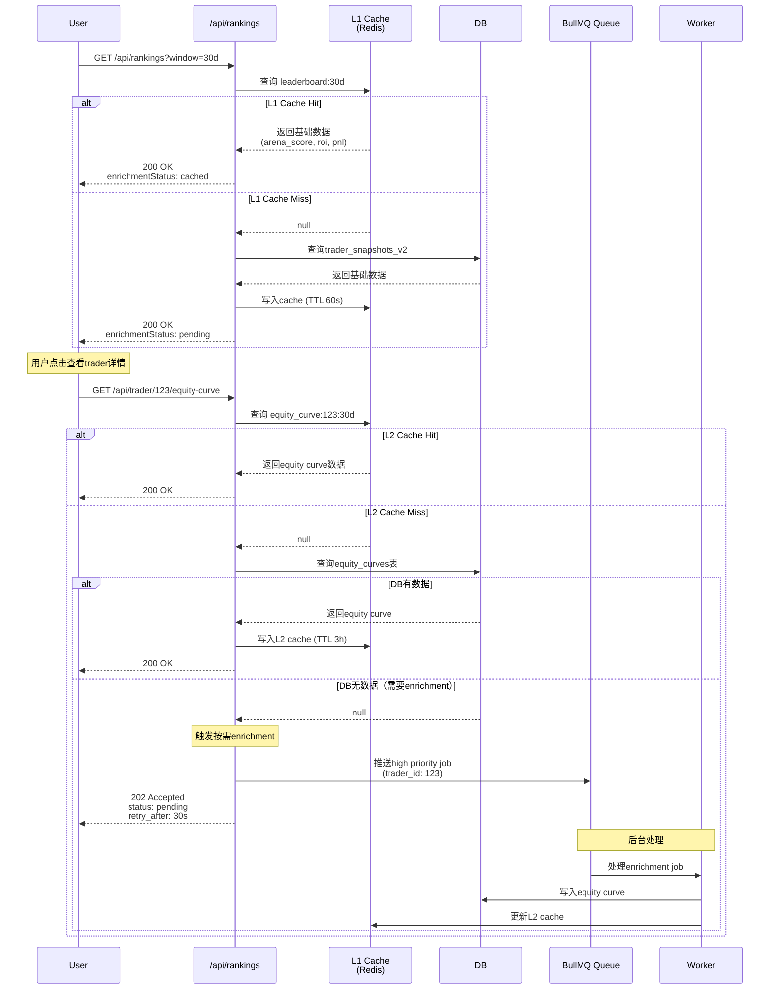
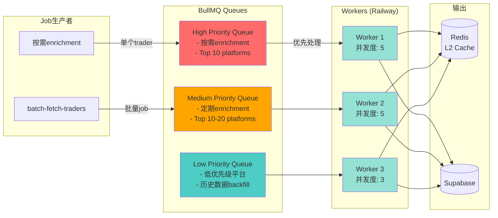
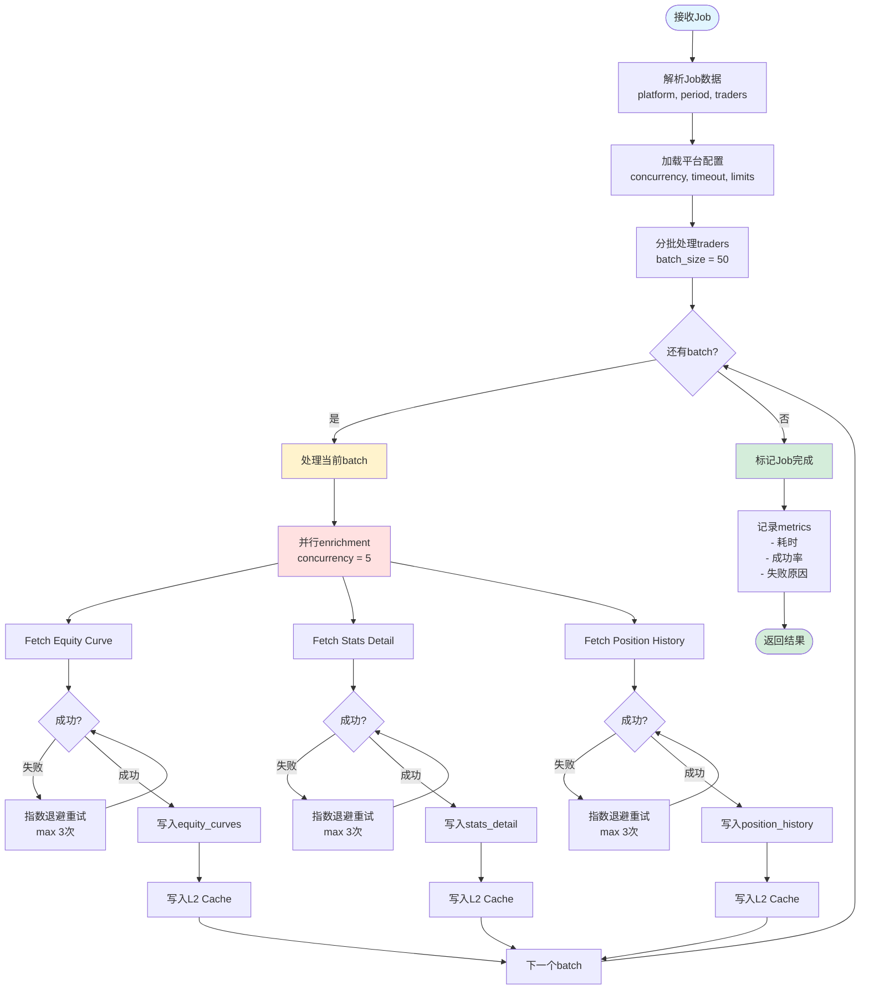
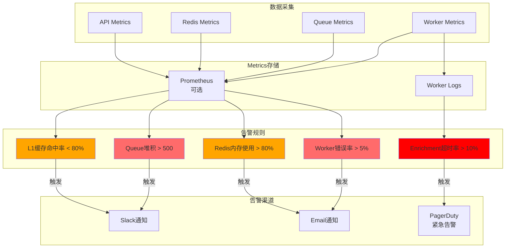
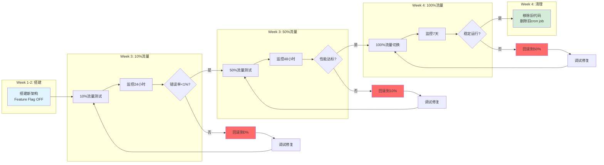

# Arena Pipeline 架构图详解

## 1. 当前架构流程图

## 2. 新架构流程图

## 3. Fetch → Enrich数据流

## 4. 用户请求分层缓存流程

## 5. BullMQ队列优先级处理

## 6. Worker内部处理流程

## 7. 监控告警流程

## 8. 灰度发布流程

## 9. 新旧架构对比

| 维度 | 当前架构 | 新架构 |
|------|----------|--------|
| **Fetch阶段** | Vercel cron → batch-fetch-traders (600s) | 保持不变 ✅ |
| **Enrich阶段** | Vercel cron → batch-enrich (600s) ❌超时 | BullMQ Queue → Railway Worker (无限制) ✅ |
| **缓存策略** | 单层（compute-leaderboard） | 三层（L1/L2/L3） ✅ |
| **超时限制** | Cloudflare 120s + Vercel 600s ❌ | Worker无限制 ✅ |
| **并发处理** | 固定7个平台 | 动态扩展（增加worker） ✅ |
| **按需enrichment** | 不支持 ❌ | 支持（high priority queue） ✅ |
| **数据新鲜度** | 3-6小时 | 实时（按需触发） ✅ |
| **扩展性** | 受限于600s ❌ | 可扩展到50+平台 ✅ |
| **成本** | $45/月 | $95/月 (+111%) |
| **复杂度** | 低 | 中（需维护queue + worker） |

## 10. 性能对比预测

```mermaid
gantt
    title Enrichment时间对比（26个平台）
    dateFormat  X
    axisFormat %s
    
    section 当前架构
    Platform 1-7  :a1, 0, 180s
    Platform 8-14 :a2, 180, 180s
    Platform 15-21:a3, 360, 180s
    Platform 22-26:a4, 540, 120s
    ❌超时（>600s）:crit, a5, 600, 60s
    
    section 新架构（Worker）
    Platform 1-26并行 :b1, 0, 180s
    ✅完成（<200s） :active, b2, 180, 20s
```

**说明**：
- **当前架构**：顺序分批处理（7个一批），总耗时~660s，超过600s限制
- **新架构**：26个平台完全并行，单个最慢180s，总耗时<200s

---

## 总结

新架构通过引入**BullMQ队列 + Railway Worker + 分层缓存**，实现：

1. ✅ **根本解决超时问题**（worker无600s限制）
2. ✅ **提升并发能力**（26个平台完全并行）
3. ✅ **按需enrichment**（用户查看时实时补充）
4. ✅ **分层缓存**（L1快速返回 + L2异步补充）
5. ✅ **可扩展性**（轻松支持50+平台）

**关键改进点**：
- Enrich阶段从Vercel迁移到Railway（绕过超时限制）
- 引入BullMQ队列（可靠性 + 优先级控制）
- 三层缓存（平衡速度和新鲜度）
- 灰度发布（降低风险）
