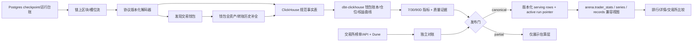

# DEX 事件优先索引计划（覆盖大部分公开交易员）— 2026-07-15

> 状态：执行规格，先影子建设，不替换现有生产读写路径。
>
> 证据刷新：2026-07-17。当前代码、只读 census、桌面截图与协议官方资料冲突时，以可验证的
> 公开链定位、当前 fixture/代码契约和官方链/合约状态为准；旧页面文案只保留为带日期的 UI
> 证据。未经单独授权，本计划新增的 DEX evidence/acquisition 路径不持久化 provider
> request/response body 或 normalized JSON body。
>
> 目标：把 DEX 数据从“按已知钱包有限回扫”升级为“按链/协议连续索引”，以可审计的
> 覆盖率、准确性和新鲜度覆盖大部分**可公开观测的交易钱包**。
>
> 约束：链上有底层事实，不等于无需口径、价格、资金流和历史边界就能得到“所有指标”；
> 任何近似值不得冒充交易所原生值或进入 Arena Score。

## 1. 决策摘要

采用事件优先架构：



- **近期选型**：SQD Portal / Pipes SDK 负责回放和连续取数，ClickHouse 保存高吞吐事实，
  `dbt-clickhouse` 管理可测试的衍生模型；Supabase Postgres 只保存 checkpoint、质量台账和
  最终 serving 结果。
- **第一优先级**：Solana（现 `okx_web3_solana`）与 BSC（现
  `binance_web3_bsc`），因为当前富化在这两条链上仍是逐钱包、有限预算、通用余额差解码。
- **第二优先级**：Hyperliquid、GMX、gTrade，把已有协议 API/子图结果与事件事实双轨对账，
  不急于替换当前可靠的原生入口。
- **扩链原则**：以“公开活跃钱包数 + 独立 DEX 交易量 + 产品需求”每月重排；不因某工具
  声称支持一条链就直接上线。
- **双管线原则**：协议事件流负责发现交易与钱包；发现后的钱包还必须补全协议外转账、
  native/token 余额和资金流。只过滤协议地址的单流不能产出可信 PnL、ROI 或权益曲线。
- **工具边界**：Dune 用于协议清单、人口与金额对账，不做实时生产真相；Arena 只把 Ponder
  用于 EVM 单协议快速原型；Substreams/Firehose、自建节点在规模和成本数据证明需要后再引入。
- **协议专用路径**：BSC/Solana 通用钱包链仍走 SQD/ClickHouse 样板；GMX/gTrade 的首个
  canonical MVP 优先用 Ponder 扫协议事件，Hyperliquid 必须用官方 node/S3 的 HyperCore 数据，
  不能套用 EVM log 索引器。
- **发布原则**：先 shadow、后 canary、再按 source 切换；原生榜单字段永不被较低质量的
  自算值覆盖。
- **证据持久化边界**：新增 DEX event/golden/acquisition 路径的网络响应只在内存中做有界读取、
  严格解析与哈希，随后清零或释放。可持久化的只有 endpoint identity、请求区间/参数哈希、HTTP
  状态、content length/hash、公开 block/tx 定位、确定性规范事实及 decoder/manifest SHA；
  `sha256:<digest>` 只是内容标识，不表示对应 body 已保存或可取回。没有通过重新获取与重算演练
  的批次必须标为 `declared_not_replayed`，不得进入 population denominator、serving、rank 或
  score。
- **现行契约 blocker**：`arena.dex.acquisition-run-manifest@2` 仍把
  `transport.raw_page_archive_required=true` 固定为旧的 raw-replay 目标，同时把
  `claims.artifact_persistence_authorized=false` 固定为安全门。后者优先：当前 manifest 只能作为
  未授权草稿，不能执行或持久化 artifact。改为 metadata-only acquisition 必须发布新契约版本并
  拒绝旧版本，不能把 `true` 解释成已有授权。

## 2. “覆盖大部分公开交易员”的可验收定义

### 2.1 不使用含糊的“所有交易员”

本计划里的交易员首先是链上地址，不自动等同于自然人。以下三项分开计数：

1. **钱包地址**：`(chain_id, normalized_address)`；同地址跨链不自动合并。
2. **协议账户**：例如 Hyperliquid 主账户/子账户、永续协议 position account。
3. **Arena 身份**：只有用户认领或有可验证绑定时，才把多个地址/交易所账户归为同一人。

链上无法可靠推导：匿名钱包背后的自然人、多个钱包是否同属一人、CEX 内部成交、私密跟单
关系、昵称/头像/简介。首页和排行不得把“地址数”写成“人数”。

“活跃钱包”固定定义为：同链、同协议、同窗口内至少发起一次成功的用户级经济 route；失败
交易、pool/router/vault leg、SPL token account 数量都不计。bot EOA、AA/smart wallet 可以是
真实交易策略，必须作为可筛选 cohort 保留，不能因“像 bot/合约”就整体删除。

### 2.2 分母与六个覆盖率

每条链、协议、时间窗都必须发布下列分母，不能只报一个漂亮百分比：

| 指标           | 定义                                                                       | 90D 生产门                             |
| -------------- | -------------------------------------------------------------------------- | -------------------------------------- |
| 产出区块覆盖   | 已落库 canonical produced block ÷ 独立来源证明应存在的 produced block      | 发布范围必须 100%；不得有未解释缺口    |
| 及时摄取率     | 在新鲜度 SLA 内落库的 produced block ÷ 应有 produced block                 | ≥ 99.99%                               |
| 协议事件覆盖   | 已成功解码 candidate ÷ 版本化宽匹配器命中的 finalized successful candidate | ≥ 99.5%                                |
| 活跃钱包召回率 | Arena 与独立参考集交集数 ÷ 独立参考集钱包数，同协议同窗口                  | ≥ 95%                                  |
| 钱包角色精度   | 抽样确认是用户交易角色的 Arena 钱包 ÷ Arena 抽样钱包                       | ≥ 99%                                  |
| 指标合格覆盖   | 有 canonical 指标的钱包 ÷ Arena 活跃钱包                                   | 核心成交指标 ≥ 95%；PnL/风险按口径单列 |

candidate 必须由版本化的宽匹配器先于 decoder 独立产出，例如命中已登记协议地址/程序的潜在
交易；selector 不读 decoder 结果且不预先过滤 execution status，失败与未知交易也先进入候选。
`transaction-membership-index` 再把它们分成 finalized successful/failed/outside/unavailable/rejected；
§2.2 的协议事件分母只取其中 successful protocol scopes。不得用“已经成功解码的事件”反过来
充当自己的分母。未知 candidate 保留公开 block/tx 定位、定位哈希和固定 reason，不保留
provider body。

“大部分”在产品层的阶段目标是：

- 先覆盖现有五个 DEX/Web3 source **上游公开集合**中的全部钱包；每次采集保存官方
  `reportedTotal` 或原始公开文件行数，不能拿当前发布上限冒充分母。现有读取上限（例如
  Hyperliquid 约 10,000、GMX 60、gTrade 分窗 25）只说明产品当前摄取量，不证明上游全集；
- 再让已支持协议对独立参考集的 90D 活跃钱包召回率达到 ≥ 95%；
- 再让支持协议覆盖目标链 ≥ 80% 的 90D DEX 交易量。交易量覆盖只是协议广度代理，**不能
  替代钱包覆盖**；
- 首页只展示通过排行发布门的去重钱包数，并把统计口径写进 tooltip/结构化数据。

独立参考集优先顺序：协议官方 API/榜单、与主摄取实现独立的第二套索引器、Dune curated DEX
tables。参考集是 benchmark，不是不可质疑的真实宇宙；每份报告同时给出交集、Arena-only、
reference-only、抓取时间和已知缺口。Solana skipped slot 是正常链事实，必须由独立 block/slot 目录
证明后排除出分母；不能把“每个 slot 都应有 block”当覆盖定义，也不能把真实 produced block
缺失包装成 skipped slot。

2026-07-16 16:32:50Z 的 `npm run census:dex` 只读基线进一步证明不能用产品 TopN 当人口
（snapshot `b194120b86c1…`）：Hyperliquid 公开全文件发现 40,664 个地址；GMX 三个活跃网络的
可重复 offset scan 暂得 7,188 个地址，但因上游无稳定 `orderBy` 仍是 provisional；Botanix 另有
13 个历史窗口地址，只用于 legacy 对账并排除 active denominator；gTrade 五个可查询 chainId
的公开榜单共观察 229 个链上身份，其中 7/30/90 命中 198 个，但多个窗口触及 Top-25 边界，
全部排除完整人口分母。数字是带抓取时间的观测，不是永久常量；正式报告必须保存 source/window
哈希、截断证据和当前链状态。

## 3. 仓库现状与真实缺口

### 3.1 已有基础

- [`ARENA_REBUILD_SPEC.md`](./ARENA_REBUILD_SPEC.md) 已定义 7/30/90D、统一详情超集、
  `NULL-collapse` 和记录区全量翻页原则。
- [`EXCHANGE_FIELD_MAPPING.md`](./EXCHANGE_FIELD_MAPPING.md) 已指出 ROI、PnL、win rate、
  realized/unrealized 在不同来源并非天然同义；事件层必须保留来源口径，不能把字段名相同
  当成定义相同。
- [`ARCHITECTURE.md`](./ARCHITECTURE.md) 与 `lib/ingest/raw.ts` 记录了现有通用
  RAW/标准化/serving 分层；legacy worker 当前会把 adapter `RawBundle` gzip 后写入
  `raw-snapshots`；`cleanupRawObjects(30)` 只默认清理未 quarantine 的对象，quarantined 对象会跳过
  清理；仓库内未见 bucket lifecycle-as-code，外部 bucket lifecycle 也尚未验收，所以 quarantined
  provider body 可能无限保留。这个既有实现不是新增 DEX evidence/acquisition artifact 的授权；
  gTrade 等 legacy 路径必须单独做 owner 授权、quarantine/manual-retention 和迁移审计。实际
  count-check、typed 评分门和 source 发布行为分散在 ingest/publish 代码、迁移和专项文档中，
  不能把架构图当成完整可执行契约。
- Hyperliquid 已有纯 HTTP board/profile/positions/fills 路径；GMX 使用协议子图；gTrade 使用
  leaderboard + cursor trade history。它们已经是协议级实现，不应为统一技术栈而重写；但当前
  实现有必须先量化的边界：Hyperliquid `userFillsByTime` 已按 2,000 fills/page 分页并冻结请求
  窗口，但官方可访问历史最多 10,000 fills；命中上限、游标停滞或无法覆盖开窗仓位时仍保持
  partial。GMX 已在 2026-07-15 修复为精确 completed-UTC 7/30/90 原生窗口，并以可回放隔离迁移
  清除了旧 mixed-PnL/derived 契约；剩余边界是生产只接 Arbitrum、官方 GraphQL offset 无稳定
  排序、canonical realized-net 没有同口径序列可算 MDD/Sharpe。gTrade 已升级为 RAW schema v3：
  冻结 90D `startDate/endDate`，在 `tradesSnapshot.rawPages` 上校验 cursor/ID/date 窗口，并检查
  `collateralPriceUsd` 存在且可解析为正数；这不是独立价格验证，也没有页级 metadata hash/status。
  只有 API 明确 exhaustion 后才发布 typed 7/30/90 指标。当前 `tier-c-profile` 会在解析前把包含
  URL/response 的整个 `bundle.pages` 交给通用 `writeRawObject`，失败 snapshot 也可能进入现有
  `raw-snapshots`；这是已确认的 legacy 行为与待迁移 blocker，不能伪装成 metadata-only，也不能
  复用为新增 DEX artifact 的授权。其生产 source 仍只覆盖 Arbitrum，开窗前仓位无法从有限窗口
  证明 lifecycle，地址发现仍来自公开 Top-25 榜单而非全事件分母；执行时价格的独立验证仍是未来
  canonical gate。
- Web3 富化已有 BSC/Solana 抓取、swap 归一化、平均成本 PnL、token 分布、PnL 日历和
  `onchain_quality` 合约。2026-07-15 的 typed 评分写入边界已 fail closed；但旧脚本仍可能把
  partial BSC `pnl_daily` 写进通用 `trader_series`，且该表没有行级 quality/provenance。这是事件
  管线前必须隔离和清理的现存缺口，不能概括成“所有近似值只在 extras”。

### 3.2 当前逐钱包富化为何不是终局

当前 `lib/ingest/onchain/*` 与 `worker/src/ingest/processors/onchain-enrich.ts` 的边界是：

- 只处理 `okx_web3_solana`、`binance_web3_bsc` 中 90D PnL 非 null 的已知钱包。默认每源每
  12 小时最多选 150 个候选：一半来自高 PnL 且超过 24 小时未更新，另一半按最旧更新时间；
  去重后实际数量可能小于 150。它不是全量扫描。
- Solana 按地址取 signatures，再逐笔 `getTransaction`；BSC 按钱包双向取 transfer pages。
  新增钱包会重复读取相同区块/交易，成本近似随“钱包数 × 历史深度”增长。
- interactive / scheduled / backfill 都有硬预算；预算是正确的成本保护，但多数活跃钱包无法
  在一次扫描中证明 90D 历史完整。
- 通用余额差 decoder 不能稳定识别复杂路由、多跳、聚合器、LP、桥、rebase、airdrop、
  wrapped native、perp funding/liquidation 等协议语义。
- BSC 内部 BNB 仍依赖 Dune/Moralis 补腿；2026-07-15 已能区分分页完成、成功零结果、页数
  截断和错误返回，但它仍是第三方、逐钱包/批钱包查询，不是可按高度重放的链上事实账本。
- 当前 token 持仓按**现价**估值，历史 quote 也可能使用非执行时价格；开窗前库存未知。
- `trader_stats.extras` 是结果容器，不是可重放的链上事实账本；decoder 修正后无法只靠现表
  确定性重算。

因此当前实现应继续作为安全降级与对照路径，但不能通过增加 TOP_N 或 RPC 配额冒充“全面
覆盖”。[`EXCHANGE_FIELD_COVERAGE.md`](./EXCHANGE_FIELD_COVERAGE.md) 是某次生产快照，且先于
2026-07-15 的近似 typed 指标隔离；它适合发现缺口，不是 canonical 证明。

### 3.3 文档漂移

[`scripts/ONCHAIN_ENRICHMENT_README.md`](../scripts/ONCHAIN_ENRICHMENT_README.md) 仍描述旧脚本、
旧表和旧 source（如 Aevo/dYdX/Drift/Jupiter 的历史富化设想），不能作为当前生产拓扑或覆盖率
权威。桌面 `交易所细节.docx` 是 2026 年早期页面截图/说明基线，不是协议人口、链状态或当前
生产契约的唯一权威：其中 Hyperliquid/GMX 没有截图，gTrade 唯一截图还直接反证“钱包不详”。
[`ARENA_REBUILD_SPEC.md`](./ARENA_REBUILD_SPEC.md) 与
[`EXCHANGE_FIELD_MAPPING.md`](./EXCHANGE_FIELD_MAPPING.md) 的旧人数、窗口和 GMX 缺失项必须按
当前代码/官方资料纠偏。后续在事件管线首个生产 source 上线时，应同步重写或归档旧脚本文档。

## 4. 可重建边界：底层事实充分，不代表指标自动准确

| 产品字段                                | 可重建性         | 成为 canonical 的必要条件                                        | 缺条件时的处理                         |
| --------------------------------------- | ---------------- | ---------------------------------------------------------------- | -------------------------------------- |
| 地址、交易时间、协议、token、方向       | 高               | finalized 事件连续；协议 decoder 命中；地址角色明确              | 缺失即拒绝该事件/报警                  |
| 成交笔数、buy/sell txns、token 数       | 高               | 先定义“链上交易/成交/多跳”的去重口径                             | 展示 decoder 范围，不跨协议硬比        |
| 成交量                                  | 高               | 每个 fill 的原始数量、decimals、执行时 USD 价格                  | 无价格的量保留 token 单位，USD 为 null |
| avg buy、top tokens、token distribution | 高               | 完整 fills + 一致的仓位周期定义                                  | 标 partial，不进评分                   |
| 手续费、gas、funding、liquidation       | 协议相关         | 协议专用事件/状态 decoder；费用币种和价格完整                    | 不用零填补未知                         |
| 当前持仓、余额、AUM                     | 条件可重建       | 最新 finalized state + 所有资产类型 + 明确 mark/oracle 口径      | 标估值时点和未定价资产                 |
| 已实现 PnL（spot）                      | 条件可重建       | 开窗库存/成本、全部买卖与转账、执行时价格、费用完整              | 开窗库存未知时不得 canonical           |
| 已实现 PnL（perp）                      | 条件可重建       | position 生命周期、partial close、funding、fee、liquidation 完整 | 必须协议专用，不用通用 swap 算         |
| 未实现 PnL                              | 条件可重建       | 当前仓位成本 + 同一时点 mark/oracle；未定价资产为 null           | 与 realized 分开展示                   |
| ROI                                     | 仅在定义后可重建 | 资金流调整后的权益基数；方法版本固定                             | 命名 `arena_roi_*`，不冒充来源 ROI     |
| win rate                                | 仅在定义后可重建 | “一笔/一仓位/一 token 周期”定义；完整 closed cycles              | 同时给 wins/total 和方法标签           |
| MDD、Sharpe、Sortino                    | 条件可重建       | 连续权益曲线、资金流调整、采样频率、无缺口、收益率口径           | 样本不足/日级近似不得 score eligible   |
| copier、followers、身份资料             | 通常不可重建     | 必须来自产品/协议公开关系或用户证明                              | 链上不猜测，诚实 null                  |

统一规则：

- **确定性链事实**与**解释口径**分层。decoder 可以升级，已发布事实按版本追加而不原地覆盖；
  新增 DEX event/golden/acquisition 路径的 provider body 仍只在内存中存在；legacy RAW 例外按
  §3.1 单列 blocker，不得混用。
- **来源原生**、**Arena canonical 自算**、**partial/estimate** 三种 provenance 不互相
  `COALESCE` 覆盖。
- `0` 是已证明为零；请求失败、分页截断、未解码、无价格都必须是 `null + reason`。
- CEX 的内部撮合和跟单关系不在本计划范围；链上转入/转出 CEX 不能还原其内部成交。

### 4.1 协议发现与钱包账本必须双轨

事件优先不等于只抓协议事件。最小闭环是：

1. 协议流连续解码 fills/positions，发现用户角色钱包；
2. 对已发现钱包补齐同窗及 opening-anchor 之前的 native、token、bridge 和普通转账；
3. 在统一 finalized cutoff 读取余额/仓位，与事件账本做资产守恒；
4. 协议外入金记为 cashflow，不直接记收益。

外部转入 token 的原始获得成本通常无法从当前钱包证明。产品必须二选一并写进方法名：

- 无法证明成本就让 whole-life PnL 保持 partial；或
- 定义 `arena_wallet_pnl_since_observation`：按入账时可验证公允价初始化 lot，并把该转入作为
  中性 cashflow。缺入账时价格仍为 partial，且该指标不得冒充交易所原生/全生命周期 PnL。

不能递归猜测转出钱包身份或把转入 token 成本默认为 0。

### 4.2 冻结指标公式

- **Arena ROI**：窗口指标采用 Modified Dietz：
  `R=(EV-BV-ΣCF_i)/(BV+Σw_i*CF_i)`，`w_i=(window_end-t_i)/window_length`。CF 使用真实时间；
  分母 ≤ 0、关键资产未定价或 cashflow 未分类时为 null。名称固定为 `arena_roi_dietz_*`，不冒充
  来源 ROI。
- **MDD**：首期只发布 UTC 日切的 `arena_mdd_daily_*`：
  `max_t(1-NAV_t/max_{s<=t}(NAV_s))`。它不是盘中 MDD；要发布盘中值必须另建小时/事件级 NAV。
- **Sharpe/Sortino**：使用资金流调整后 NAV 的简单日收益、365 年化、risk-free=0、Sortino
  MAR=0；零波动为 null。7D/30D 样本不足，风险指标只做 estimate/不进评分；90D 至少 80 个
  有效日收益、价格覆盖 ≥99%、无未解释日缺口才可申请 canonical。
- **win rate**：spot 按完整 closed token inventory cycle；partial sell 留在同一 cycle，版本化
  dust 阈值，transfer-out 作为 cashflow/库存转移而非输赢。perp 按协议 position lifecycle；两者
  不混成一个分母。任何值同时发布 `wins/closed_total/methodology_version`。

## 5. 目标数据契约

### 5.1 控制面（Supabase Postgres）

新增控制表只保存小数据，不把高吞吐事件灌进现有 Postgres：

#### `arena.chain_stream_checkpoints`

| 字段                               | 含义                                                      |
| ---------------------------------- | --------------------------------------------------------- |
| `chain_id, stream_name`            | 主键；例如 `solana/mainnet-dex-v1`                        |
| `finalized_height, finalized_hash` | 最后已验证 canonical produced block/slot                  |
| `head_height`                      | 采集器观察到的 head                                       |
| `decoder_manifest_sha`             | 协议地址、ABI/IDL、版本的不可变清单 SHA                   |
| `source_provider`                  | `sqd_portal` / fallback RPC / future firehose             |
| `lag_seconds, gap_count`           | 新鲜度与未解释 produced-block 缺口；skipped slot 单列证据 |
| `updated_at, last_error`           | 运维状态                                                  |

#### `arena.dex_publish_runs`

保存每次 `(chain, protocol, timeframe, metric_family, methodology_version)` 的输入范围、模型 SHA、行数、
质量阈值、shadow diff、批准状态和回滚目标。另建 `arena.dex_source_active_runs` 保存
`(source, timeframe, metric_family) -> run_id`；发布和回滚必须在事务中原子切换指针，而不是
只记一条无法恢复旧值的审计元数据。

### 5.2 事实层（ClickHouse）

所有金额先保存原始整数和 decimals；浮点数不得作为账本主值。

#### `acquisition_batch_observations` / `acquisition_page_observations` / `acquisition_page_item_observations`

provider body 不落库不等于可以丢掉请求边界。每次固定查询 lane 先写一条 batch metadata：
`batch_id, observation_contract, run_manifest_sha256, chain_id, lane_id, endpoint_profile_id,
source_endpoint_identity_sha256, source_independence_group, query_template_contract,
query_template_sha256, public_start_height, public_end_height, public_start_time,
public_end_time, input_cursor_commitment, output_cursor_commitment, stop_reason, request_count,
page_count, item_count, first_public_block_or_tx_id, last_public_block_or_tx_id,
batch_chain_sha256, verification_state, started_at, completed_at`。

每页只写：
`page_observation_id, page_envelope_sha256, page_item_set_sha256, batch_id, page_ordinal,
request_params_sha256, request_body_sha256,
request_body_byte_length, request_hash_basis, input_cursor_commitment, output_cursor_commitment,
public_start_height, public_end_height, public_start_time, public_end_time, transport_status,
reported_content_length, content_byte_length, content_sha256, content_hash_basis, item_count,
first_public_block_or_tx_id, last_public_block_or_tx_id, previous_page_observation_sha256,
stop_reason, completed_at`。`batch_id` 与 `page_observation_id` 必须由带 schema/domain 的
contract hash 计算；page ordinal 从 0 连续，非首项的 previous SHA 必须指向前页，末页
`stop_reason` 与 batch 一致。同一 batch/page key 重取出现不同 `content_sha256` 必须 fail closed。

hash basis 不得留给实现猜测：有请求 body 时固定为
`utf8_json_rpc_request_body_bytes`；无 body 的 HTTP 查询使用版本化的
`strict_canonical_request_descriptor_utf8_bytes`，descriptor 只含 method、公开 path template、
公开 range 与非秘密参数，禁止完整 URL/query/header。响应固定为
`fetch_content_decoded_http_entity_body_bytes_before_utf8`；`reported_content_length` 只是可空的
header 诊断，不能代替实际 `content_byte_length`。若换 wire-byte 或 canonical-JSON 口径，必须发
新 schema/contract，不能沿用同一 SHA 字段。

所有 request/page/batch contract hash 共用 `arena.strict-canonical-json@1`：UTF-8、无空白，
object key 按 Unicode code point 排序、array 保持契约顺序、公开高度/slot/时间整数使用无前导零的
base-10 string、禁止 float/undefined/重复 key，string 不做静默 Unicode 改写。
`request_params_sha256 = SHA256("arena.dex.request-params@1\0" || canonical(public_params))`；
public params 只允许 endpoint profile 明列的非秘密字段。
`strict_canonical_request_descriptor_utf8_bytes` 的 payload 固定为
`{contract,method,public_path_template,public_range,request_params_sha256}`，不能增加 host、完整
URL/query/header 或 credential。

`batch_id` 只由 `observation_contract/run_manifest_sha256/chain_id/lane_id/endpoint_profile_id/
source_endpoint_identity_sha256/source_independence_group/query_template_sha256/public range/
initial cursor commitment` 的 canonical payload 与 `arena.dex.acquisition-batch-id@1` domain
重算，不包含页结果或时间戳。

page/item 使用无环的两阶段闭包。先以 `arena.dex.acquisition-page-envelope@1` domain 重算
`page_envelope_sha256`，payload 是 page 除自身、`page_observation_id`、
`page_item_set_sha256`、`completed_at` 外的全部语义字段，包括 previous page SHA、
request/content hash+length+basis、cursor、range、status、item count、public IDs 与 stop reason。
page 0 的 previous SHA 必须等于契约固定 genesis，其余 page 必须精确引用 ordinal `n-1` 的最终
page ID。

每个 item ID 再由 `page_envelope_sha256` 与 item 除自身/final page ID 外的全部语义字段按
`arena.dex.acquisition-page-item@1` domain 重算；按 ordinal 排序的完整 item ID 列表、
item count 与 terminal item ID 以 `arena.dex.acquisition-page-item-set@1` domain 生成
`page_item_set_sha256`。最终
`page_observation_id = SHA256("arena.dex.acquisition-page@1\0" ||
canonical({page_envelope_sha256,page_item_set_sha256}))`。item row 保存最终 page ID 只作外键，
loader 必须反向验证它等于所属 envelope/item root 生成的 page ID，不能把它纳入 item hash 制造
循环。

`batch_chain_sha256` 再由除自身和 `started_at/completed_at` 外的全部 batch 语义 header
（明确包含 `source_independence_group`、`verification_state`）、ordered page IDs、terminal page
字段 `terminal_page_observation_id/terminal_stop_reason` 与
`arena.dex.acquisition-batch-chain@1` domain 重算；空页 batch 只能使用契约固定 empty terminal。
loader 必须从 item→page→batch 逐级重算 terminal root，不能只信 batch header。

候选分母只接 transaction-bearing page。endpoint profile 必须冻结 `page_item_contract`：EVM
`eth_getLogs` 以单个返回 log 为原子，EVM block/receipt lane 以单个 transaction 为原子，Solana
block lane 以 `(slot, transaction_index)` 的 transaction 为原子；嵌套响应按公开
`(height_or_slot, transaction_index, chain_sub_index)` 展平，不得把“整页”“整块”与“一笔交易”
混成同一个 `item_count`。非 transaction discovery page 必须使用另一 observation contract，
不能进入 candidate coverage 计数。

每个有效 transaction-bearing item 只写一条 metadata：
`page_item_observation_id, batch_id, page_observation_id, page_item_ordinal, page_item_contract,
page_envelope_sha256, chain_id, source_height_hint, source_block_hash, transaction_id,
chain_sub_index, item_content_byte_length, item_content_sha256,
item_hash_basis`。`item_hash_basis` 固定为版本化的
`strict_lossless_canonical_json_utf8_bytes@1`；解析必须拒绝重复 key、非有限数和超过契约精度的
number，不能先经 JavaScript `number` 丢精度。item body 只在内存中参与哈希并随 page body 一起
清零/释放，表内不保存其 JSON。

每页必须满足：item ordinal 唯一且正好覆盖 `[0,item_count)`，item rows 数等于 page
`item_count`，其 batch/page/contract 与 endpoint profile 完全相等；batch `item_count` 等于全部
page item rows 之和。任何顶层/嵌套解析失败、缺 transaction ID、ordinal 缺口/重复或 item
commitment 漂移都拒绝整页和整批，不能用一个自报的 non-candidate count 吞掉坏数据。

opaque cursor 仍只保存 domain-separated commitment，不保存 credential URL/query；batch 的公开
height/time range + query template 负责从头重跑。若 provider 只能依赖不可重建 cursor 且无法按
公开 range 重新查询，该 batch 必须保持 `declared_not_replayed`。event 与 block 行必须通过
`batch_id/page_observation_id/page_item_ordinal` 直接绑定到唯一页；fact 行通过
`source_event_uid` 传递绑定到 event 的同一 tuple。禁止把 request-level status/hash 重复塞进
每个 event/fact 行。

#### `candidate_selection_index` / `transaction_membership_index`

`arena.dex.candidate-selection-index@1` 是 decoder 前的唯一候选计数 artifact。header 必须绑定：
`run_manifest_sha256, query_policy_sha256, batch_chain_sha256, checkpoint_chain_sha256,
protocol_manifest_contract, protocol_manifest_sha256, golden_subset_sha256, public window,
discovery_endpoint_profile_id, discovery_endpoint_identity_sha256,
candidate_selector_contract, candidate_selector_version, candidate_selector_config_sha256,
implementation_git_sha, selection_stage=pre_decoder, execution_filter=none,
source_replay_state, population_denominator_authorized=false`。index 永不自授生产分母权限。
selector config 必须冻结 match kind；BSC 使用登记 contract/factory child/log emitter/
`transaction.to`/trace call address，Solana 使用 ALT 解析后的 outer/inner program ID。禁止读取
decode status、token balance delta、execution outcome 或已生成 fact 来决定是否入选。

index 内先为每个 `page_item_observation_id` 写且只写一条 `selection_row`：
`selection_row_id, batch_id, page_observation_id, page_item_ordinal,
page_item_observation_id, item_content_sha256, selection_outcome, candidate_id, reason_code`。
行按 `(batch_id,page_observation_id,page_item_ordinal)` 排序；`selection_outcome` 只能为
`candidate | non_candidate`。candidate 必须带可重算的 candidate ID 且 reason 为空；
non-candidate 必须让 candidate ID 为空并使用版本化固定 reason。selection rows 必须与 run
绑定的全部 transaction-bearing page item 做无缺口、无额外项的一一反连接。只有 frozen selector
至少产生一个通过 protocol manifest 校验的 match 才能标 candidate；否则必须是 non-candidate，
不能先创建空 candidate 再补 matcher。

另为每个全链唯一 candidate 交易只写一行：`candidate_id, transaction_id, source_height_hint,
protocol_matches[], golden_wallet_assignments[], source_observations[]`。`candidate_id` 由
`(chain,transaction_id)` 的 domain-separated contract hash 计算；每个 `protocol_match` 带
`protocol_scope_id, protocol_id, protocol_deployment_epoch_id, program_or_contract_id,
matcher_rule_id, match_kind, matched_identity, chain_sub_index`。`protocol_scope_id` 的唯一 tuple 固定为
`(chain_id,transaction_id,protocol_id,protocol_deployment_epoch_id)`；同一交易/协议/epoch 下
多个 address、log、outer/inner instruction 或 matcher rule 只作为排序去重后的
`matcher_evidence[]`，不得多算 scope；一笔交易命中两个不同协议才有两个 scope。
`source_observations` 只引用
`selection_row_id/batch_id/page_observation_id/page_item_ordinal/page_item_observation_id/
request_params_sha256/content_sha256/item_content_sha256`，且每个 candidate selection row
必须被一个且仅一个 candidate row 引用。candidate 行按 candidate ID 字节序。header 同时发布且
不得混称：
`raw_page_item_observation_count, candidate_item_observation_count,
non_candidate_observation_count, duplicate_candidate_observation_count,
global_unique_transaction_count, protocol_candidate_scope_count,
golden_wallet_candidate_assignment_count`。

每个 candidate row 必须至少有一个 source observation 和 protocol match，且不得出现没有对应
selection row 的额外 candidate。`protocol_matches/matcher_evidence/source_observations/
golden_wallet_assignments` 分别按契约键排序并 exact-dedupe 后才能计算 row SHA；同一 matcher
evidence 必须能反连接到 matched page item 的 identity/subindex 与已绑定 protocol manifest。

selection 与 candidate 两个有序 row stream 分别按 4096 行切 chunk。每个 chunk 固定
`stream_kind, chunk_ordinal, row_count, first_key, last_key, previous_chunk_sha256, row_sha256[]`；
row SHA、chunk SHA 都以 schema/domain + strict canonical UTF-8 JSON 重算，首 chunk 使用契约固定
genesis SHA。`selection_set_sha256` / `candidate_set_sha256` 分别由 ordered chunk SHA、总行数和
末 chunk SHA 重算；空 stream 使用契约固定 empty root。`candidate_selection_index_sha256`
必须由不含自身与 `generated_at` 的 canonical header、两个 set SHA 和完整 ordered chunk
descriptor 列表重算。loader 必须读取 rows 逐级复算，禁止只信 header 自报的 root/count/hash。
其中 `raw_page_item_observation_count` 是 selection rows 数，
`candidate_item_observation_count/non_candidate_observation_count` 分别按 selection outcome
过滤，`global_unique_transaction_count` 是 candidate rows 数，
`duplicate_candidate_observation_count = candidate_item_observation_count -
global_unique_transaction_count`；`protocol_candidate_scope_count` 是上述精确 tuple 的 distinct
scope ID 数，`golden_wallet_candidate_assignment_count` 是 distinct
`(candidate_id,golden_wallet_id)` 数。任何值都不得从 header 单独读取。

`arena.dex.transaction-membership-index@1` 必须绑定
`candidate_selection_index_sha256`、同一 run/query/batch/checkpoint/protocol/window、
`transaction_evidence_endpoint_profile_id/identity_sha256`、chain-specific membership policy、
finality-anchor policy 与 semantic SHA；`provider_independence=not_asserted`。每个 candidate 正好
一行：

`candidate_id, transaction_id, outcome, canonical_position(height,transaction_index),
source_height_hint, membership_policy, evidence_endpoint_profile_id,
evidence_endpoint_identity_sha256, evidence_metadata_sha256,
verified_finality_document_sha256, provider_finality_semantic_sha256,
stable_transaction_facts_contract, stable_transaction_facts_sha256, reason_code`。

`outcome` 只能是 `verified_in_window_succeeded | verified_in_window_failed |
verified_outside_window | evidence_unavailable | evidence_rejected`。前三者必须来自 strict
chain verifier 并携带 stable-facts SHA；unavailable/rejected 禁止伪造 stable facts，只能带固定
reason。membership rows 必须与 candidate rows 使用完全相同的 candidate ID 顺序并一一相等，
同样按 4096 行生成带 previous SHA 的 chunk；header 发布五类 outcome count。
`membership_set_sha256` 和 `transaction_membership_index_sha256` 使用与 candidate index 相同的
逐行、逐 chunk、再 header 的 domain-separated 重算规则，并排除自身与 `generated_at`。必须逐行
重算五类 outcome count，并满足：

```
raw page-item observations
  = candidate item observations + non-candidate observations

candidate item observations
  = global unique transactions + duplicate candidate observations

global unique transactions
  = in-window succeeded + in-window failed + outside window
    + unavailable + rejected
```

shadow decoder recall 的结构分母是 membership outcome 为 `verified_in_window_succeeded` 的
distinct `protocol_scope_id`，不是 `chain_event_observations` 或成功解码行；但这不自动等于可发布
population denominator。

生产使用还必须生成独立、无环的 `arena.dex.denominator-eligibility-attestation@1`。它绑定原始
candidate/membership index SHA、一次不同 acquisition run 的 refetch candidate/membership index
SHA、同一 public window/selector config/protocol manifest/finality policy，以及双方去掉
page/provider provenance 后的三个 roots：

- `selection_semantic_set_sha256`：按
  `(chain_id,source_height_hint,source_block_hash,transaction_id,chain_sub_index)` 排序的全部
  transaction-bearing item，保留 selection outcome、candidate ID/reason；
- `candidate_semantic_set_sha256`：按 candidate ID 排序的 transaction ID、去重 protocol scope
  tuple 与 golden assignment；
- `membership_semantic_set_sha256`：按 candidate ID 排序的 outcome、canonical position、
  stable-facts SHA/fixed reason。

三个 root 都沿用上文逐行/逐 chunk/domain-separated 算法，字段不能由实现自由删选。只有 loader
逐级复算四个 index、两次三个 semantic sets 全部相等、refetch/recompute evidence 通过且
`eligibility=refetch_recompute_verified` 时，attestation 才能固定
`population_denominator_authorized=true`。任一 source replay state 为
`declared_not_replayed` 且没有这份有效 attestation 时，只能 shadow，并明确保持
`population_denominator_authorized=false`。attestation 自身也必须以
`arena.dex.denominator-eligibility-attestation@1` domain 对排除自身 SHA/`generated_at` 的
canonical payload 重算；不能只加载一个 authorization boolean。

run closure、`arena.dex_publish_runs` 与 acquisition transcript 必须同时绑定
`candidate_selection_index_sha256`、`transaction_membership_index_sha256` 和
`denominator_eligibility_attestation_sha256`；任一缺失、额外 tx、重排、计数不等、未加载 artifact
逐级重算或 hash 漂移都 fail closed。普通候选可用 manifest 指定的单 evidence provider；
Golden RPC 双源只验证 golden 抽样，不能外推全体 provider independence。

#### `chain_event_observations`

最小 metadata-only 观察行：`event_uid, chain_id, height, block_hash, parent_hash, block_time,
tx_id, tx_index, record_kind, chain_sub_index, program_or_contract, topic_or_discriminator,
payload_sha256, payload_byte_length, block_observation_id, batch_id, page_observation_id,
page_item_ordinal, decoder_manifest_sha, normalized_fact_set_sha256, verification_state,
ingest_version, ingested_at`。`payload_sha256` 只绑定当次内存输入，不对应已保存 blob；表内不得
出现 request/response body、normalized JSON body、header、credential URL/query、cookie/token
或 provider error body。

`chain_sub_index` 必须保留 EVM `log_index/trace_address` 或 Solana outer/inner instruction path，
不能用一个模糊 `event_index` 混合。ClickHouse 不强制唯一约束，`event_uid` 只是逻辑键。
摄取必须确定性去重，并用重复投递测试证明相同链段 checksum 不变。金额和余额只以经过 schema
验证的原始整数 + decimals 进入下方规范事实表，不以整段 JSON 或 program-data 数组旁路落库。
另建追加式 `chain_block_observations(block_observation_id, chain_id, height, block_hash,
parent_height, parent_hash, status=commit|revert, observed_finality, finality_policy_contract,
verified_finality_document_sha256, provider_finality_semantic_sha256,
finality_anchor_semantic_sha256, source_provider, source_endpoint_identity_sha256,
source_independence_group, batch_id, page_observation_id, page_item_ordinal, observation_reason,
observation_version, supersedes_observation_id, reverts_observation_id, observed_at)`。
`block_observation_id` 必须由除自身外的完整语义做 domain-separated contract hash；
`observation_version` 在同一 `(chain_id,height,source_independence_group)` 内从 1 严格单调且唯一，
`observed_at` 不参与胜负。version `n>1` 必须准确 supersede 同 scope 唯一的 version `n-1`，既不
允许跳号也不允许分叉；`status=revert` 还必须准确指向同 scope 的 prior commit
`reverts_observation_id`，而该 commit 必须是应用 version `n-1` 后的当前 active commit；禁止
撤销更老/已撤销行、悬空、跨高度或循环引用。

状态迁移只允许：`none→commit`、`commit(same_hash)→commit(same_hash)`（仅单调强化
finality/evidence，parent 与 block 语义不得变）、`active_commit→revert(active_commit)`、
`revert→commit`。不同 block hash 的 `commit(old)→commit(new)` 永远非法，必须先追加显式 revert，
下一 version 才能 commit 新 hash；same-hash commit 也不得降低 finality、替换 independence group
或绕过新的 strict finality document。

canonical commit 必须加载并通过 strict schema/semantic verifier 重算
`verified_finality_document_sha256`、provider finality semantic 和 anchor semantic；文档中的
chain/height/hash/provider/policy 必须与 observation 完全相等，不能只信 row 上的字符串。view
先按上述 scope 选择唯一最高 version，应用显式 revert/supersede 链，再执行 finality 门。

从 manifest 声明且已验证的 segment anchor 开始，候选 canonical 链必须按“相邻 produced
position”连续：EVM 非 genesis block 要求 `parent_height=height-1`；Solana 允许 skipped slot，
但 `parent_height` 必须等于 finalized produced-slot resolver 给出的前一个实际产块 slot，且
`parent_hash` 必须匹配该 slot。每个相邻 produced block/slot 都必须存在并精确指向前一已选
block；缺 produced position、父哈希断裂、anchor 不匹配或 reverted parent 都冻结断点及后续
发布。不同 `source_independence_group` 对同一高度仍冲突时同样冻结该高度及后续发布，不用时间戳
任选一边。独立差分只能比较不同 independence group，不能把同一 archive/operator 的两个客户端
算双源。event 必须持有确切 `block_observation_id`，fact 再由 `source_event_uid` 传递该绑定。禁止
在 observation 行上原地翻 `canonical` 布尔值，也不能把 `ReplacingMergeTree` 的最终合并当同步
正确性保证。

Phase 0 默认实现**自定义 immutable target**：event/block observation 与规范事实都按版本追加，
reorg 通过新 observation 撤销，受影响 marts 重建。SQD Pipes 内置 ClickHouse target 不能原样
接到这套表：
它对 `CollapsingMergeTree` 写 `sign=-1` cancel row，其他 engine 会做 lightweight `DELETE`；依赖
`min/max/uniq/argMax` 等不可逆 materialized aggregate 时仍须重建尾部。如果 spike 改选内置
target，必须显式改为 `CollapsingMergeTree/VersionedCollapsingMergeTree`、所有查询/MV 做
sign-aware 或 `FINAL`，并通过 fork replay；两种回滚模型不得混用。

#### 规范事实

- `fact_swap_legs`：每个 pool/market fill leg；token-in/out 的 `amount_raw` 分列保存为不会经
  JavaScript `number` 的 UInt256-compatible decimal/string，另存 decimals。
- `fact_wallet_routes`：用户级经济 route，一笔聚合器多跳只计一次用户交易/成交量，并关联所有
  `fact_swap_legs`；不得直接把 leg 数当用户交易数。
- `fact_asset_transfers`：native/ERC-20/SPL 转账、mint/burn、方向、counterparty、转账原因。
- `fact_position_events`：open/increase/decrease/close/liquidation、size、collateral、leverage、
  realized PnL。
- `fact_funding_fees`：funding、borrow fee、trading fee、gas 等独立流水。
- `fact_wallet_cashflows`：deposit/withdraw/bridge 等外部资金流；无法分类时为
  `unknown_cashflow`，不能静默计入收益。
- `fact_event_valuations`：保存 `price_source`、`price_timestamp`、`confidence`、
  `methodology_version`、`amount_usd`。USD 估值不是不可变链事实，不能藏进确定性 fill fact
  或 `amount_raw` 列后失去价格版本。

每张事实表必须携带：`source_event_uid, observed_finality, decode_status,
decoder_manifest_sha, source_provider, observed_at`。当前 canonicality 从 block observation view
派生；`source_event_uid` 必须唯一联接到 event observation，并由该 event 的
`block_observation_id` 与 `batch_id/page_observation_id/page_item_ordinal` 传递 block/page
provenance。协议升级使用新 `protocol_version`，禁止就地改变旧事件含义。

### 5.3 dbt 账本与指标层

模型按依赖顺序建设：

1. `stg_*`：类型、地址、token decimals、时间、去重与 canonical 过滤。
2. `int_trade_routes`：把一笔多跳交易归成 route，同时保留每个 fill。
3. `int_wallet_lots`：FIFO 与 average-cost 都可重算；产品先延续现有 average-cost，但方法名
   不能省略。
4. `int_wallet_positions`：协议专用仓位生命周期与 closed cycles。
5. `int_wallet_cashflow_adjusted_equity`：余额、仓位、资金流、执行/mark price 对齐。
6. `mart_wallet_daily`：每天统一 cutoff 的 balance/equity/PnL/volume/fees/cashflow。
7. `mart_wallet_metrics_7_30_90`：ROI、PnL、win rate、MDD、Sharpe、Sortino 及样本数。
8. `mart_wallet_metric_quality`：每项指标的 coverage、price quality、limitations、是否可评分。

所有模型最少具备 `unique`、`not_null`、relationships、accepted-values、窗口连续性、金额守恒、
非负原始数量、重跑幂等测试。模型版本与 decoder manifest 一起进入发布记录。

### 5.4 写回现有 Arena

- 继续使用 `(source_id, exchange_trader_id)` 建 `arena.traders`；event discovery 新钱包先进入
  `discovered` 状态，不直接上榜。
- 新增 `arena.dex_metric_versions`，以
  `(run_id, source_id, trader_id, timeframe, metric_name, methodology_version)` 保存 typed value、
  quality、provenance、`as_of` 和 eligibility；来源原生值与 Arena 自算值是不同 metric row，
  headline selector 必须有显式、版本化优先级。series/positions/records 同样必须带 `run_id` 与
  行级 quality/provenance，或进入对应的版本表。
- dbt/publish 先完整写入一个不可变 run，验证行数和质量后再原子切换
  `arena.dex_source_active_runs`。在指针 commit 前不得直接覆盖单版本 `arena.trader_stats` 或通用
  `trader_series`；现有表只通过 active-run 兼容视图或事务内最终物化消费。高基数字段保留在
  ClickHouse，不塞入 `extras`。
- `extras.onchain_quality` 升级时必须向后兼容，至少增加：事件起止高度、decoder/model SHA、
  population denominator、gap count、historical price coverage、opening inventory coverage。
- 现有 schema v1 只接受 `wallet-balance-delta-average-cost@1.0.0`，且用一个全局 gate 控制整包
  指标。事件管线上线前必须先落 schema v2：按 `volume/pnl/win_rate/risk/positions` 分别保存
  blocking reasons、非阻断 disclosure、coverage、price quality 和 score eligibility。当前 v1
  writer 永远保持 estimate；先部署能识别 v2 且未知版本 fail-closed 的 parser、DB score gate
  和 UI consumer，再部署 shadow writer。v1 reader 不得把 v2 猜成 canonical，现有全局
  `promoteExtrasMetrics` 不能用于 v2 的逐指标放行。
- 评分视图只接受新增质量字段 `metric_provenance='arena_event_rebuild'` 且质量合约 canonical
  的行；不要复用现有 `public.trader_sources.source_kind` 表达指标来源。现有
  `scoreEligibleWinRate`/stored quality fail-closed 行为保留。
- 原生榜单 PnL/ROI 与自算 PnL/ROI 并列存储。只有明确定义的 source 优先级可以决定 UI
  headline，不能靠 SQL 列顺序偶然覆盖。

### 5.5 主页、交易所排行与详情页消费契约

- **主页 `/`**：`real-time`、OG `32+` 与分散刷新文案已经收敛到
  `lib/config/product-facts.ts`，SEO/OG/JSON-LD 现在声明按 2 小时重算和 tracked source families。
  剩余口径缺口是 `get_hero_stats.exchange_count` 只从 90D 有效 ranking row 的 source slug 取
  首段去重，不是 `arena.exchanges` 的真实交易所总数；`trader_count` 是合格排行账户行数，不是
  去重钱包或自然人数，同一主体可跨 source 重复。Hero/partner strip/tooltip 必须继续共用可解释
  的 active-source/platform 口径；事件管线不得把 discovered 地址数塞进 Hero。
- **交易所排行 `/rankings/exchanges`**：当前 RPC 从 latest count-check snapshot 聚合单一
  `headline_roi`，没有逐指标 quality/method filter；`ProvenanceFooter` 只含 source/as-of/derived，
  `DerivedBoardBadge` 只说明 timeframe derived。上线前必须同时扩 DB/RPC/types/UI，令
  `rankedTraders`、median/top-decile ROI、盈利比例只聚合同口径且通过发布门的值，并显示
  methodology、quality 和 `as_of`；native ROI 与 `arena_roi` 不可混成一个中位数。
- **交易员详情**：现有 `onchain-insights.ts` 的 dedicated estimate path、quality disclosure 和
  NULL-collapse 保留。canonical 后才允许进入通用 MetricGrid；交易记录、仓位和 PnL 日历均
  显示链、协议、数据截至高度/时间和方法版本，钱包地址继续可复制。
- **方法页/结构化数据**：source 从 shadow 切 primary 时同步更新 `/methodology`、tooltip 和
  JSON-LD 文案；“real-time”只有达到本计划 SLA 才能使用，否则写明确刷新周期。

## 6. 技术选型与开源工具边界

### 6.1 首选：SQD + ClickHouse + dbt-clickhouse

本节是 BSC/Solana 通用链事件面的首选，不强迫所有协议使用同一入口；GMX/gTrade 的 EVM
协议 MVP 与 Hyperliquid 的 HyperCore 路径见 §6.2/§6.3。

- SQD 当前官方文档提供 Portal HTTP、Pipes SDK 和 Squid SDK；Pipes 的 source 本身读取
  Portal，所以 Portal HTTP 与 Pipes 是两种接入方式，不是两套独立真相。Phase 0 用相同
  Portal dataset 比较裸 HTTP 与 Pipes 的字段、恢复、吞吐和成本；独立差分仍须来自官方 RPC/
  API、Substreams provider 或协议数据。
- Portal 的一条 HTTP stream 可以在 `toBlock` 前正常结束。客户端必须以“相同 query SHA +
  最后返回高度 `N`”落 checkpoint，从 `N+1` 续扫；靠近 head 时还要传 `parentBlockHash` 并处理
  HTTP 409。只收到一次 200 或只比较首尾高度不能证明区间完整。
- Pipes SDK 当前仍是 **Beta/alpha package**；2026-07-16 仓库 main 为
  `@subsquid/pipes@1.0.0-alpha.16`，npm `latest`/`beta` 又指向 0.1 beta 线，且要求 Node.js ≥
  22.15。样板必须锁精确 version、dist integrity、源码 SHA 与 runtime；没有 fork/幂等/退出
  恢复证据不得升级或进生产。
- 授权必须按 endpoint 区分：2026-05-19 起旧 `v2.archive.subsquid.io` gateway 的外部请求
  需要 API key；当前 `portal.sqd.dev` Public Portal 无需注册但有限速，官方已预告后续 key 与
  pricing tiers。manifest 必须固定 endpoint、auth mode、rate plan 与报价；不能把当前免费开发
  入口当生产 SLA 或永久成本。
- 开源代码与托管数据面也必须分开：Squid SDK/Pipes 仓库根许可证为 Apache-2.0，但当前 Pipes
  package metadata 另写 MIT，必须对实际发布 artifact 做法务锁定；`sqd-portal` 为 AGPL-3.0。
  自建 Portal 的历史数据仍来自 SQD Network（带宽取决于 stake），近 head 数据来自 HotblocksDB；
  “能自建 API 层”不等于拥有独立全历史真相或退出能力。
- ClickHouse 用于事件事实和窗口聚合；常用查询键必须是强类型列，不能把协议关键字段都
  藏在 JSON/Map 中。
- `dbt-clickhouse` 支持 incremental、tests、snapshots 等；生产初期只用稳定 materialization，
  experimental distributed/materialized-view 能力不作为上线依赖。

### 6.2 备选与后续

| 工具                         | 适用位置                                    | 本阶段边界/准入门                                                                                                                                                                                                                                                 |
| ---------------------------- | ------------------------------------------- | ----------------------------------------------------------------------------------------------------------------------------------------------------------------------------------------------------------------------------------------------------------------- |
| 托管 Substreams provider     | 独立差分、大规模可重放流、协议模块复用      | 公共端点需要鉴权；列出 BNB/Solana 端点不证明 BNB extended/internal-call 字段齐全，必须对同一 7 天样本验字段                                                                                                                                                       |
| 自建 Firehose + Substreams   | provider SLA/成本失效后的长期链级数据面     | 不是“装一个通用服务”即可；每条链都需 instrumentation、reader/merger/storage 运维和历史回填证明                                                                                                                                                                    |
| Ponder                       | GMX/gTrade EVM 协议 canonical MVP           | MIT、TypeScript、自托管，最贴合现 Node/Postgres 栈；RPC 完整性、archive 回填吞吐与 provider 退出仍由 Arena 证明，不用于 HyperCore/Solana                                                                                                                          |
| Goldsky Mirror               | EVM 快速回填、托管第二数据源                | reorg-aware 且列出 ApeChain/MegaETH；它是托管 pipeline，不是可自托管开源引擎。只有成本/SLA/退出路径过门才采购，不能成为唯一真相                                                                                                                                   |
| Graph Node                   | 复用许可证明确的既有 subgraph manifest      | graph-node 可自托管，但 AssemblyScript/schema/RPC archive/IPFS/Postgres 运维不适合作为 Arena 统一多链账本；无 LICENSE 的协议 manifest 不 vendor                                                                                                                   |
| Carbon                       | Solana decoder/processor 与数据源适配器 PoC | MIT Rust；支持 nested CPI、IDL 生成、Geyser/RPC/历史/快照 datasource。它是可复用的解码框架，不是独立数据真相、finality 证明或 BSC 解码器；同一交易仍须与 Arena observation/evidence contract 对接                                                                 |
| Yellowstone Vixen / Fumarole | Solana parser/CPI 与可恢复实时流 PoC        | Vixen 为 MIT parser/runtime/codegen；Dragon's Mouth source 的 replay 只覆盖 provider 保留窗口。Fumarole 默认 AGPL-3.0（指定 client/crate 有 Apache-2.0 例外）、可持久续流但仍是 limited beta，不能冒充开放 90D archive；主源与独立差分源必须分开                  |
| Old Faithful + Jetstreamer   | Solana 历史回放与 SQD/RPC 差分              | Old Faithful 为 AGPL-3.0 且仍处 RFC/非生产阶段；Jetstreamer 为 Apache-2.0/MIT replay toolkit。可回放历史 block/tx/log，但 archive 没有 account updates，不能单独重建当前账户状态或作为唯一生产真相                                                                |
| Envio HyperIndex / HyperSync | 法务批准后的 BSC/Solana PoC/shadow          | Solana 已支持 instruction、inner/CPI、Token/Token-2022 balance、logs/meta 和 `rollback_guard`，但仍是 rolling retention、缺 handler native SOL/account subscription；BSC 列有普通 endpoint，未列专用 BSC traces endpoint。许可不是 OSI 开源，不能称独立开源数据面 |
| Dune                         | 协议覆盖、金额、钱包人口、价格结果独立对账  | catalog 页约 30 分钟而通用 freshness 页写 curated 通常每小时、Solana 约 6–7 小时；只走官方 API/Datashare，禁爬站，并先确认商业条款/credits                                                                                                                        |
| Reth / ExEx                  | 长期自建 EVM 执行与自定义抽取               | ExEx 编译进同一 Reth 进程，不是无隔离 sidecar；故障可影响节点，优先 remote sink。BSC 支持与可选依赖许可证逐项验收                                                                                                                                                 |
| Agave + Yellowstone gRPC     | 长期自建 Solana 低延迟 finalized 流         | `from_slot` 只在服务端有限 replay buffer 内有效，不是 90D archive；deshred 是 pre-execution，缺 status/log/inner/balance，不能进入 canonical 命中分母。server/plugin 默认 AGPL-3.0-only，clients/proto 为 Apache-2.0；版本/容量/法律均过门                        |

任何候选都必须用同一份 7 天链段和 golden wallet 集合跑 bake-off；比较的是**缺口、可重新获取
并确定性重算、吞吐、成本和延迟**，不是 GitHub stars。

### 6.3 协议专用工具：能复用什么，不能假设什么

没有一个现成仓库同时解决全历史、连续发现、协议生命周期、钱包资金流、价格、质量证明和
发布回滚。每个候选必须登记 `acquisition_mode/license/self_hosted/historical_range/block_identity/
numeric_precision/reorg_model/cost/source_independence`；缺许可证的公开仓库只能阅读和对账，不得
默认复制、修改或作为生产依赖。

| 协议/工具                           | 立即采用                                                                                                                                                                                                      | 明确边界与验收门                                                                                                                                                                                                                                                                                                 |
| ----------------------------------- | ------------------------------------------------------------------------------------------------------------------------------------------------------------------------------------------------------------- | ---------------------------------------------------------------------------------------------------------------------------------------------------------------------------------------------------------------------------------------------------------------------------------------------------------------- |
| Hyperliquid 官方 non-validator node | 连续流使用 `--write-fills --batch-by-block`，按需增加 order status、misc events、system/CoreWriter actions；官方 S3 的 `node_fills_by_block`、旧 fills/trades、`explorer_blocks`、`replica_cmds` 用于历史回填 | `hyperliquid-dex/node` 仓库有 Apache-2.0 文件，但核心 `hl-node` 由 visor 下载并校验 signed binary；因此称“官方可自托管节点”，不称“可审计的开源节点实现”。本地 Info server 只支持部分当前状态，不支持历史 time series/websocket。S3 与 live node 必须重叠区间 checksum 对账，缺块/重复/格式切换 fail closed       |
| SQD Hyperliquid fills dataset       | 作为独立实现的快速 shadow source 和吞吐 spike；官方 Pipes 示例可按 user 过滤 fills                                                                                                                            | 示例依赖同一个 Portal dataset，且只请求 block number/timestamp；上线前必须实测起始高度、hash/parent、精度、缺口和 reorg 语义。它不能同时充当主摄取与独立分母，也不能因有示例就宣称全历史完整                                                                                                                     |
| Gains Network SDK                   | MIT SDK 用于 ABI、地址、类型、PnL/borrowing/funding/fee 公式和版本归一化；官方 backend/WS 与 `getAllTrades` 用于当前状态和 shadow 对账                                                                        | Polygon/Arbitrum/Base/ApeChain/MegaETH 均进入带 `as_of` 的 deployment manifest；官方顶层合同页与链专页对 ApeChain 状态存在漂移，必须逐链标 `active/historical/legacy`，不能只凭 endpoint 存在宣称活跃。stats subgraph 无 LICENSE 且缺 MegaETH，不 vendor、不作 canonical；地址发现来自全事件，不来自 Top-25 榜单 |
| GMX 官方 GraphQL / Reader           | 活跃链 Arbitrum/Avalanche/MegaETH 的 GraphQL 用于 bootstrap 与 shadow；Reader/DataStore 校验当前仓位。Botanix endpoint 仅保留历史核对                                                                         | 官方 SDK 标记 Botanix 为 legacy/withdrawals-only，必须排除 active census/ranking。GraphQL offset 无稳定排序，funding snapshot 不等于实时状态；长期 canonical 从 EventEmitter logs 独立解码。`gmx-subgraph` 无 LICENSE；`gmx-synthetics` 现为 BSL 1.1、2026-08-31 后才转 GPL-2.0+，当前不复制生产实现             |

协议接入顺序固定为：官方历史/节点或链日志在内存中严格验证 → metadata-only observation +
Arena 规范事实/账本 → 官方 API/托管 indexer 对账。任何第三方聚合结果都不能反过来成为自己的
完整性分母。

## 7. 链与协议优先级

### P0：现有产品面的两条通用钱包链

1. **Solana / `okx_web3_solana`**

- 先从榜单 top、随机长尾、极高频钱包各抽样，生成 program 命中分布。
  - 首批 decoder 覆盖 Jupiter route 及样本中贡献最大的直接池；Raydium/Orca/Meteora/
    Pump 系协议是候选，不在 live 样本与程序地址清单确认前宣称已覆盖。
  - 必须处理 versioned tx、inner instructions、SPL/Token-2022、wrapped SOL、失败交易和
    缺失 block time。

2. **BSC / `binance_web3_bsc`**
   - 先以榜单钱包样本生成 router/pool/selector 分布，锁定 PancakeSwap 及实际主导的聚合器/
     meme router 版本。
   - receipt logs、trace/internal call、native BNB/WBNB 必须同一交易闭合；仅 ERC-20 Transfer
     事件不能证明成交。
   - 每个 decoder 用真实 tx golden fixture 覆盖 buy、sell、多跳、税费 token、失败 tx、
     internal refund、迁移/桥。

### P1：已有协议级 DEX

- **Hyperliquid**：现有 board + info API 保持主路径。事件管线先 shadow 验证 fills、funding、
  deposits/withdrawals 与 7/30 原生窗口；[`hyperliquid-spike.md`](./hyperliquid-spike.md) 的
  38,582 是 2026-06-11 的测量值，不是永久人口常量；2026-07-16 公开文件已观察 40,664。
  `userFillsByTime` 当前实现为 2,000/page 且有冻结窗口、去重、exhaustion/limit/stall 证据，但
  官方最多只可访问最近 10,000 fills；高频账户、开窗仓位或命中上限时仍保持 partial。全历史与
  连续人口改用官方 non-validator node + S3 `node_fills_by_block`/`replica_cmds`，不能只加 API 页数。
- **GMX（当前 serving Arbitrum；目标 Arbitrum/Avalanche/MegaETH）**：精确 7/30/90 completed-
  UTC 原生窗口和 realized-net PnL v2 已修复，不再是事件管线 blocker。以现有 Squids/API 结果
  为对照，Ponder/EventEmitter decoder 必须包含 position、fee、funding、borrowing、liquidation、
  price impact 和现金流，不用 swap-only 账本替代 perp 语义；Reader/DataStore 做当前状态对账。
  Botanix 只保留 withdrawals-only 历史 lane，禁止进入 active denominator。
- **gTrade**：现有 cursor history 的 schema v3 覆盖门继续作为生产原生入口；事件管线不重复
  实现这层分页。下一步用官方 SDK/ABI 解释协议版本，按 Polygon、Arbitrum、Base、ApeChain、
  MegaETH 的带状态 deployment manifest 分别回放 open/increase/decrease/partial-close/close/
  liquidation、borrowing/funding/holding/trading fee，建立全事件地址分母；先解决开窗前仓位 anchor，
  再与 v3 snapshot/`getAllTrades` 做逐钱包 shadow diff。未覆盖链、状态未确认、缺 opening event 或
  lifecycle 未闭合时保持 partial，不用当前 Arbitrum Top-25 公开名单冒充全网交易员宇宙。

### P2：扩展公开交易员宇宙

- Drift、Jupiter Perps、dYdX 等只有在官方索引/链数据能定义稳定的账户与仓位生命周期后加入。
- Base、Ethereum、Arbitrum 其他 DEX 依每月独立数据的活跃钱包/交易量排序加入。
- 每新增一个协议必须先登记：部署地址与生效高度、升级机制、ABI/IDL 来源、钱包角色、费用、
  价格来源、reorg/finality、golden tx、停止支持规则。

## 8. 分阶段执行顺序与验收门

每个勾选项单独小 commit，测试通过即 push；禁止把整阶段堆成一个提交。以下工期是单人聚焦
开发的容量估算，不是跳过退出门的日历承诺；协议分布或 provider 字段不满足时阶段必须延长。

### Phase 0 — 基线与 7 天技术样板（3–5 个工作日）

- [x] 建只读 DEX census 契约/CLI：完整公开文件、provisional offset scan、bounded TopN 三种
      分母分离；任何身份均 `rank_eligible=false`，Botanix legacy 强制 excluded。
- [x] 建 deployment-evidence manifest 严格契约；当前 fixture 固定 GMX/gTrade 官方地址证据，
      `purpose=deployment_evidence_only` 且未验证项保持 `verification_state=draft`，不能进入候选分母。
- [x] 建 BSC/Solana draft seed protocol manifest：固定当前登记的协议/程序/合约身份、来源与
      canonical SHA，并显式保持 `verification_state=draft`；不能把 GMX/gTrade deployment fixture
      冒充这两条通用链的 manifest。
- [ ] 验证 BSC factory child set/start/end blocks、Solana deployment/code epochs，并把两链
      `decoder_owner` 从 null 补成可追责 owner；这些 blocker 未关闭前，draft manifest 不得进入
      candidate denominator、decoder authorization 或生产发布。
- [ ] 发布 metadata-only `acquisition-run-manifest@3` 并拒绝仍要求 raw page archive 的 @2；
      保持 execution/artifact persistence/serving/rank/score 全部未授权，直到真实 artifacts
      逐项加载验签。
- [ ] 单独审计并迁移 gTrade/legacy `writeRawObject` provider-body 路径；未取得 owner 授权前，
      不得把既有 `raw-snapshots` 行为扩展到 DEX event/golden/acquisition artifact。
- [x] 固定 100 个 golden wallets：每链 top 20、随机 20、异常/高频 10；保存全局快照与每链 50
      钱包 subset 的 canonical SHA，严格拒绝缺行、重排、跨链或 cohort 漂移。
- [ ] 固定 BSC/Solana golden tx 清单，并绑定 transaction/receipt/meta/finality evidence SHA。
- [ ] 用 SQD 拉同一 7 天 BSC 与 Solana 样本，记录完整性、延迟、bytes、费用投影。
- [ ] 建本地/隔离 ClickHouse batch/page/event/block observation DDL 与 dbt skeleton，不连接生产
      serving。
- [ ] 建 checkpoint、缺口扫描、幂等 replay 测试。
- [ ] 生成 `backup-snapshot@1`，从其 object inventory 闭包做空 ClickHouse 集群恢复，验证
      §11.4 的 checksum、同 cutoff active-pointer、RPO/RTO 硬门。

退出门：任意 produced-block/slot 区间重复跑两次，事实行 checksum 一致；断点中断后无重无漏；若 SQD 缺
关键 inner/trace 数据，则停在样板阶段并进入 Substreams/RPC bake-off，不继续 90D 回填。

### Phase 1 — BSC 事实闭环（约 2–4 周）

- [ ] 解码 live 样本覆盖率前 80% 的 router/pool 族，再迭代到事件覆盖 ≥ 99.5%。
- [ ] 统一 receipt + trace/internal + BNB/WBNB，最终替代 Dune/Moralis 的第三方逐钱包补腿；
      迁移前继续保留现有显式覆盖证明和 fail-closed 门。
- [ ] 建协议 fills + 钱包全资产 transfers/cashflow 双管线、average-cost lots、daily ledger。
- [ ] 对 100 wallets 计算 7D，和 Binance Web3 board + 现富化三方 diff。
- [ ] 扩到 90D shadow，验证开窗库存；外部转入按 §4.1 明确选择 partial 或
      `arena_wallet_pnl_since_observation`，不能靠回放到首次看见钱包假设成本已知。

退出门：零缺口区间；金额守恒；独立参考集活跃钱包召回率 ≥ 95%；board 的 tx/volume/PnL 按本节
准确性阈值通过；无法证明 opening inventory 的钱包保持 partial。

### Phase 2 — Solana 事实闭环（约 2–4 周）

- [ ] program 命中清单、Jupiter route 与主要 direct-pool decoder。
- [ ] inner instructions、Token/Token-2022、SOL/wSOL、费用、失败 tx 的 golden tests。
- [ ] route-level 与 fill-level 双事实，避免多跳被算成多笔用户交易。
- [ ] 7D → 90D shadow，与 OKX Web3 board/profile summary 逐钱包 diff。
- [ ] 将现按钱包 signatures/getTransaction 作为 fallback/抽样审计，不再作为全面覆盖主路径。

退出门同 BSC；另外未解释 produced-slot gap 为零、skipped slot 有独立证据。未知 program
不得伪造“成交金额”；分别报告 candidate decode recall、可由余额变化得到的 unknown-value
proxy 与独立协议 volume proxy。

### Phase 3 — 钱包发现与大部分公开交易员（约 2–4 周）

- [ ] 从事实流主动发现钱包，不依赖交易所榜单提供名单。
- [ ] 版本化角色分类：`user_signer`、`smart_wallet`、`subaccount`、`router`、`pool`、`vault`、
      `relayer`、`unknown`。只把基础设施角色排除出用户排行；bot/smart wallet 保留为独立 cohort。
- [ ] 生成链/协议 population denominator 和 overlap 矩阵；同地址只在同链去重。
- [ ] 分离 `discovered`、`metric_ready`、`rank_eligible`，防止垃圾地址污染首页人数。
- [ ] 完成协议广度 ≥ 80% volume proxy、同协议钱包覆盖 ≥ 95% 的报告。

退出门：随机抽 200 个 reference-only 地址，Arena 能解释为何收录/未收录；随机抽 200 个
Arena 地址，≥ 99% 确为用户角色而非合约/池/router。

### Phase 4 — 生产 shadow、canary 与发布

- [ ] 影子运行至少 14 天，现有 native/API 路径继续服务。
- [ ] 每日生成 source×TF diff：人口、rank overlap、指标误差、stale、unknown/null。
- [ ] 先对内部/管理员启用详情事件卡，再对 5% 钱包启用，最后 source 级切换。
- [ ] Arena Score 单独审批；只放行 canonical 指标，不能因 UI 看起来合理而放行。
- [ ] 扩充 pipeline health、freshness sentinel、备份/恢复和发布 smoke。

退出门：连续 7 天全部 SLA 绿；无 P0/P1 reconciliation defect；完成一次 decoder 错版、provider
中断、ClickHouse 不可用和 source 回切演练。

### Phase 5 — Hyperliquid/GMX/gTrade 与滚动扩协议

- [ ] 按 P1 顺序逐协议建立专用 position/funding/fee decoder。
- [ ] 每个协议独立 canary，禁止“通用 DEX decoder 一次性全开”。
- [ ] 每月按人口、volume proxy、产品点击和成本更新优先级。

## 9. 覆盖、准确与新鲜度 SLA

### 9.1 新鲜度

| 层                              | 目标                                          | 违约动作                                  |
| ------------------------------- | --------------------------------------------- | ----------------------------------------- |
| finalized event → ClickHouse    | p95 ≤ 5 分钟，p99 ≤ 15 分钟                   | 标 source stale；停止新发布，不清空旧值   |
| ClickHouse → daily/window marts | p95 ≤ 10 分钟                                 | 重跑受影响 incremental partitions         |
| marts → Arena serving           | p95 ≤ 15 分钟；绝不超过现有 Tier-A 2 小时 SLO | 超 30 分钟显示 stale；超 2 小时回切原路径 |
| 90D backfill/replay             | 有进度与 ETA，不冒充实时 SLA                  | checkpoint 停滞 15 分钟报警               |

另报端到端 `serving_freshness = now - latest_finality_observed_at represented by active_run`，不能把
各层 p95 相加冒充端到端 SLA，也不能用可漂移的 block time 代替 finality observed time。Solana
按 commitment/root，BSC 按单独确认/finality 策略配置；没有一个跨链通用 `depth`。15 分钟目标
统一称 **near-real-time**；只有另有更严格、公开定义和实测 SLA 时才使用 “real-time”。未
finalized 数据可用于内部 preview，不得成为公开排行真相。

### 9.2 准确性

在 golden wallets + 每日随机样本上：

- tx/fill 数：与协议官方/第二索引器 exact match ≥ 99.5%；差异都能落到具体 tx 和 reason。
- token 原始数量：支持事件必须精确相等；decimals/rounding 只发生在展示层。
- USD volume：有可靠执行时价格时，
  `abs(actual-reference) <= max(1 USD, 0.005*abs(reference))`；无可靠价格则 null。
- PnL：只有窗口、价格、资金流与成本法公开且相同才作数值真值比较；否则官方 board 只是
  reconciliation signal。canonical 数值样本沿用上式，但同时要求公布 eligibility rate、最少
  样本数和 partial 原因，不能排除难算钱包后只报幸存者误差。
- rank：对原生榜单同人口同口径比较，Top100 overlap ≥ 95%，rank Spearman ≥ 0.95；口径不同
  必须在产品命名中区分，不能为追求相似而暗调公式。
- 任一指标不得以 `0` 代替 unknown；每指标冻结分母、最少样本和绝对百分点阈值。只有历史
  基线非零且样本充足时才使用“突增 2 倍”；unknown >5% 只是默认警戒线，不替代指标级门。

### 9.3 数据质量预算

- 任一未解释 produced block/slot gap、重复 active publish、decoder manifest 漂移：P0，冻结发布。
- canonical 指标发现重大错算：立即回切，受影响行降为 partial，按 decoder/model SHA 定向重算。
- 同一 source 7 天内第二次 SLA 违约：暂停扩协议，优先完成可靠性整改，沿用现有
  [`SLO.md`](./SLO.md) 原则。

## 10. 测试与上线验收矩阵

| 层             | 必做测试                                                                                               |
| -------------- | ------------------------------------------------------------------------------------------------------ |
| decoder unit   | 每个协议版本的真实 tx fixture；buy/sell/multihop/refund/fail/fee/upgrade                               |
| property       | 数量守恒、同事件幂等、地址归一化、负数/overflow、乱序输入确定性                                        |
| reorg/finality | 替代 block/hash、回滚 N 高度、重复 delivery、checkpoint 恢复                                           |
| dbt            | unique/not-null/relationships、窗口连续、cashflow/equity reconciliation、incremental 等价 full-refresh |
| differential   | SQD vs fallback RPC/Substreams；Arena vs 官方 API/榜单；Arena vs Dune                                  |
| population     | reference-only 与 Arena-only 双向抽样、合约/池/router 误收率                                           |
| serving        | NULL-collapse、provenance/estimate/stale badge、7/30/90 切换、交易所排行口径                           |
| score          | partial/legacy/malformed quality 全部 fail closed；canonical golden rows 才放行                        |
| load/cost      | 峰值 events/s、catch-up 速度、压缩率、查询 p95、磁盘 70% 水位                                          |
| disaster       | provider 断流；ClickHouse 空集群恢复；decoder bad deploy；Postgres active-run pointer 对账             |

CI 只使用固定小链段和 fixtures；生产 90D shadow 在独立 job 跑。任何 diff 报告必须保存公开
block/tx ID、规范位置、两侧 fact-set SHA 和固定 reason，不能只输出汇总百分比，也不能附带
provider body。

## 11. 成本、容量与保留

### 11.1 上线前必须测量的成本式

```
月成本 = SQD 请求/流量
       + ClickHouse compute/storage/backup
       + fallback RPC/trace
       + 对象存储规范事实/manifest 与重新获取演练
       + 监控与人工运维
```

Phase 0 报告必须给出：每百万候选事件、每百万 decoded fills、每 1 万活跃钱包、一次 90D
回放的成本和耗时。未拿到真实测量，不在文档中承诺“免费”或固定月费。

### 11.2 容量门

- 正常实时流 CPU/内存/磁盘持续水位 < 70%；任一分区 > 70% 先扩容或降保留，不等写满。
- catch-up 吞吐至少为目标链峰值的 3 倍，否则一次中断会永久追不上。
- 生产启用付费 provider/Cloud 前，记录报价、预算 owner 和 hard monthly alert；超预算 80% 告警，
  100% 禁止自动扩容/回填。
- 在内存读取阶段按协议地址过滤来源流；不为了未来可能用到而永久保存整条链无关事实或任意
  provider body。

### 11.3 建议保留

- ClickHouse event/block observations：至少 120 天热存；规范事实同样至少 120 天，覆盖 90D
  重算余量。observations 只含上述 metadata 和 hash，不含可反解的 provider body。
- R2/对象存储 Parquet：按链/日期归档 **规范事实 + observation metadata + manifest + checksum
  ledger**，至少保留 1 年。它不是 raw-body 备份；修复旧 decoder 必须从已证明可重新获取的
  provider/节点按公开 range/tx ID 重取并重算。取不回的旧批次保持 `declared_not_replayed`，不得
  宣称恢复或重解码成功。
- daily marts、发布 run、quality evidence：长期保留，用于历史排名解释。
- 删除/TTL 不得早于对应 publish run 已证明的重新获取/重算范围；改保留期需先通过 provider
  refetch、checksum 与成本演练。

### 11.4 备份恢复硬门

raw-body refetch/redecode 与已保存事实的灾备恢复是两条不同验收，不得互相替代。首次 canary 前必须
先生成不可变 `arena.dex.backup-snapshot@1`：

`snapshot_contract, snapshot_id, cutoff_at, created_at, object_inventory_sha256,
schema_engine_closure_sha256, manifest_closure_sha256,
postgres_active_pointer_snapshot_sha256, previous_snapshot_sha256, per_chain_frontiers[]`。
每个 chain frontier 必须包含 `chain_id, finalized_height, finalized_hash,
latest_included_observed_at, batch_page_chain_sha256, block_observation_set_sha256,
event_fact_set_sha256, candidate_selection_index_sha256,
transaction_membership_index_sha256, denominator_eligibility_attestation_sha256`。

object inventory 每行固定 `logical_role, object_key, byte_length, content_sha256,
min_logical_time, max_logical_time, contract_sha256`；role 必须覆盖规范事实、
batch/page/page-item/event/block observations、candidate/membership index 全部 header/chunk/row、
denominator eligibility attestation、checksum ledger、schema/engine DDL、manifest closure 和下述
Postgres pointer artifact。`cutoff_at` 约束对象内记录的逻辑水位：
`max_logical_time <= cutoff_at`；备份文件可以在 cutoff 后生成或上传，不能把对象创建时间误当数据
cutoff，也不能让一个跨 cutoff 的 mutable object 混入。

cutoff 必须由协调屏障产生：先停止新的 publish pointer 切换，封口所有纳入 inventory 的
append-only partition/batch，再在同一个 repeatable-read database snapshot 内记录
`database_snapshot_identity` 与 cutoff，之后才解除屏障；不能在任意晚时刻读取“当前指针”倒推
旧 cutoff。

另生成 `arena.dex.postgres-active-pointer-snapshot@1`：从上述 database snapshot 导出 canonical
`dex_publish_runs` 与 `dex_source_active_runs` rows，固定
`as_of_cutoff, database_snapshot_identity, source/timeframe/metric_family, active_run_id,
run_closure_sha256, candidate_selection_index_sha256, transaction_membership_index_sha256,
denominator_eligibility_attestation_sha256, quality_evidence_sha256, rollback_run_id,
row_updated_at`；每行 `row_updated_at <= as_of_cutoff = cutoff_at`。其 artifact 必须作为 inventory
row 持久化并逐行重算
`postgres_active_pointer_snapshot_sha256`，不能只在 backup header 自报一个摘要；所有 active run
与非 null rollback run 都必须存在于同一 inventory/manifest closure 且 run logical time 不晚于
cutoff。

`object_inventory_sha256`、schema/engine closure、manifest closure 和 pointer snapshot SHA 均由
实际 inventory/artifact 逐级重算；inventory rows 按 `(logical_role,object_key)` 排序，
`object_inventory_sha256 = SHA256("arena.dex.backup-object-inventory@1\0" ||
canonical(ordered_inventory_rows))`，inventory 不把自己的容器对象列成 row。
`snapshot_id = SHA256("arena.dex.backup-snapshot@1\0" ||
canonical(snapshot_without_snapshot_id_and_created_at))`；因此不含自身与诊断性的 `created_at`，
但包含 cutoff、previous snapshot、全部 closure SHA 与 per-chain frontiers。上一 snapshot 指针
不得断链。RPO 以 `cutoff_at - latest_included_observed_at` 逐链计算，不能用备份任务开始或上传
完成时间冒充。

然后在隔离的空 ClickHouse 集群完成：

1. 选择一个严格通过的 backup snapshot，只从其 object inventory 闭包内的规范事实、
   batch/page/page-item/event/block observation metadata、candidate/membership index、
   denominator eligibility attestation、pointer artifact、manifest 和 checksum ledger 恢复；
   禁止读取生产 ClickHouse、inventory 外对象或 provider body。
2. 逐分区核对 row count、首末高度、重复主键、gap、fact-set SHA、batch/page hash chain 和
   block observation set、candidate/membership index SHA、denominator attestation、
   decoder/manifest closure SHA；恢复后的 checksum 必须与 snapshot 完全相等。
3. 重建 marts 后，先从 inventory 内的 pointer artifact 恢复隔离的 Postgres staging 表，再用
   `postgres_active_pointer_snapshot_sha256` 对账 `dex_publish_runs` 与
   `dex_source_active_runs`；不得把生产 Postgres 当恢复输入。active pointer 必须属于同一 cutoff、
   指向已完整恢复且仍通过质量门的 run。缺 run、hash 漂移、跨 cutoff 或悬空 pointer 必须 fail
   closed，继续服务 last-known-good/stale 快照，禁止用空结果或半恢复数据覆盖生产。
4. 单独从公开 range/tx ID 重取一个固定小链段，证明 decoder 修正的 refetch/recompute 路径；
   取不回只影响 replay eligibility，不能把已保存事实的空集群恢复误报为失败，反之亦然。

初始 canary 目标固定为：observations/规范事实 **RPO ≤ 15 分钟**，空集群恢复到核心 fact 查询可用
**RTO ≤ 4 小时**，完整 90D marts 与 active-pointer 对账 **RTO ≤ 24 小时**。Phase 0 必须给出实测
值；任一超标都阻断 canary。首次演练通过后至少每季度一次，并在 schema、对象布局、manifest 或
ClickHouse engine 变更后追加演练。

## 12. 回滚与故障降级

### 12.1 功能开关

至少提供：

- `DEX_EVENT_INGEST_ENABLED`：停止继续取流，不删除已落库事实；
- `DEX_EVENT_TRANSFORM_ENABLED`：停止 dbt 增量；
- `DEX_EVENT_PUBLISH_ENABLED`：阻断写入 Arena；
- source 级新增 `dex_event_mode = off | shadow | canary | primary`。不得复用现有
  `arena.sources.serving_mode`（其 `legacy | shadow | serving` 已承担 adapter 切换语义）。

默认均为 shadow/off；开关归控制面，不把 secrets 或运行状态写入 Git。

### 12.2 回滚步骤

1. 关 `PUBLISH`，保留 ingest 继续收事实，避免恢复后产生历史洞。
2. source/metric/TF 的 `dex_event_mode` 切回 `off`；有 native 路径则回 native；event-only 新钱包
   回 last-known-good event run 或从排行隐藏。Redis/ISR 缓存失效并 smoke 排行与详情。
3. 在事务中把 `dex_source_active_runs` 指回上一个仍保留完整版本数据的已通过 run；
   `dex_publish_runs.rollback_of` 只做审计，不能替代版本数据和 active pointer。
4. 若降为 partial，同一事务清空对应 typed score inputs；随后重算排行并失效缓存。只对已证明
   可重新获取的 `(height range, decoder_manifest_sha, model_sha)` 重取并重算，不做无边界全库
   UPDATE；来源取不回时保持 `declared_not_replayed`。
5. diff 与 SLA 重新连续通过 7 天后才能再 canary。

### 12.3 失败模式

- provider 断流：checkpoint 不前移；切 fallback 只补同一连续高度；不能跳洞追 head。
- chain reorg：最终性窗口内不发布；已发布高度发生重组则撤 canonical、重建受影响 marts。
- decoder 未识别升级：unknown 事件率报警并冻结该协议发布，原生/API 路径继续服务。
- ClickHouse 不可用：serving 继续读上一个 Postgres 快照并显示 stale，不从空结果覆盖生产。
- Postgres publish 部分失败：同一 run 幂等重试；无完整 commit verdict 不刷新 source freshness。

## 13. 第一批实际任务（严格按顺序）

1. 建 `dex_protocol_manifest` 与 golden wallets/tx 文档，只提交 fixtures/manifest。
2. 建 SQD 7 天只读 spike，输出 BSC/Solana 字段与成本报告，不接生产。
3. 建 ClickHouse 最小 DDL + checkpoint/replay harness。
4. 建 BSC 第一个协议 decoder + golden tests。
5. 建 BSC facts/dbt 7D shadow + 三方 diff。
6. 补 BSC 协议覆盖到退出门，再扩 90D；不能未过门先跳 Solana。
7. 建 Solana program manifest 与第一个 decoder，重复同一节奏。
8. 建 population discovery/过滤/coverage ledger。
9. 接 Postgres shadow publish 与 UI provenance，不接 Score。
10. 14 天影子验收、故障演练、source canary；Score 另开决策与提交。

每个任务采用：fixture/契约 → 实现 → 单测/差分 → 小 commit → push → 下一项。生产 worker
的双节点/SHA 遵守 [`INGEST_WORKER_TOPOLOGY.md`](./INGEST_WORKER_TOPOLOGY.md)，单消费者与部署
前互斥检查遵守 [`INGEST_WORKER_DEPLOY.md`](./INGEST_WORKER_DEPLOY.md)；新索引器未纳入该拓扑前，
不与现 worker 抢同一 BullMQ job。

## 14. 官方资料

- SQD SDK/Portal/Pipes 概览：<https://docs.sqd.dev/en/sdk/overview>
- SQD 接入方式比较：<https://docs.sqd.dev/en/sdk/options-comparison>
- SQD Pipes SDK：<https://github.com/subsquid/pipes-sdk>
- SQD BSC Portal dataset：<https://docs.sqd.dev/en/data/evm/binance-mainnet>
- SQD Solana Portal API：<https://docs.sqd.dev/en/portal/solana/api>
- SQD API keys：<https://docs.sqd.dev/en/data/api-keys>
- SQD 开源 SDK：<https://github.com/subsquid/squid-sdk>
- SQD Portal stream 续扫语义：<https://docs.sqd.dev/en/portal/evm/quickstart>
- SQD gateway/Portal API key 变更：<https://docs.sqd.dev/announcements/gateway-api-keys>
- SQD 自建 Portal 与数据源：<https://github.com/subsquid/sqd-portal>
- Hyperliquid 官方节点：<https://github.com/hyperliquid-dex/node>
- Hyperliquid 历史数据：<https://hyperliquid.gitbook.io/hyperliquid-docs/historical-data>
- Hyperliquid L1 数据 schema：<https://hyperliquid.gitbook.io/hyperliquid-docs/for-developers/nodes/l1-data-schemas>
- Hyperliquid Info API 历史限制：<https://hyperliquid.gitbook.io/hyperliquid-docs/for-developers/api/info-endpoint>
- SQD Hyperliquid fills 示例：<https://github.com/subsquid/pipes-sdk/blob/main/docs/examples/hyperliquid/01.user-fills.example.ts>
- Gains Network SDK：<https://github.com/GainsNetwork-org/sdk>
- Gains Network SDK 合约地址：<https://github.com/GainsNetwork-org/sdk/blob/main/src/contracts/addresses.json>
- Gains Network 合约部署：<https://docs.gains.trade/what-is-gains-network/contract-addresses>
- Gains Network backend/事件流：<https://docs.gains.trade/developer/integrators/backend>
- gTrade stats subgraph：<https://github.com/GainsNetwork-org/gtrade-stats-subgraph>
- GMX 官方 GraphQL：<https://docs.gmx.io/docs/api/graphql/>
- GMX 合约架构/EventEmitter：<https://docs.gmx.io/docs/api/contracts/architecture/>
- GMX 官方网络状态：<https://docs.gmx.io/docs/sdk/v1/exports/configs/contracts/>
- GMX 旧 subgraph：<https://github.com/gmx-io/gmx-subgraph>
- GMX synthetics 与当前许可证：<https://github.com/gmx-io/gmx-synthetics>
- Envio HyperIndex：<https://github.com/enviodev/hyperindex>
- Envio HyperIndex 许可边界：<https://github.com/enviodev/hyperindex/blob/main/licenses/README.md>
- Envio Solana HyperIndex：<https://docs.envio.dev/docs/HyperIndex/solana>
- Envio Solana HyperSync：<https://docs.envio.dev/docs/HyperSync/solana>
- Envio HyperSync networks：<https://docs.envio.dev/docs/HyperSync/hypersync-supported-networks>
- Goldsky Mirror：<https://docs.goldsky.com/mirror/about-pipeline>
- Goldsky 支持链：<https://docs.goldsky.com/chains/supported-networks>
- ClickHouse：<https://github.com/ClickHouse/ClickHouse>
- ClickHouse schema design：<https://clickhouse.com/docs/use-cases/observability/schema-design>
- ClickHouse + dbt：<https://github.com/ClickHouse/dbt-clickhouse>
- dbt Core：<https://github.com/dbt-labs/dbt-core>
- Substreams：<https://github.com/streamingfast/substreams>
- Substreams chains/endpoints：<https://docs.substreams.dev/reference-material/chain-support/chains-and-endpoints>
- Firehose Core：<https://github.com/streamingfast/firehose-core>
- Ponder：<https://github.com/ponder-sh/ponder>
- Graph Node：<https://github.com/graphprotocol/graph-node>
- Dune curated DEX data：<https://docs.dune.com/data-catalog/curated/dex-trades/overview>
- Dune data freshness：<https://docs.dune.com/data-catalog/data-freshness>
- Dune SQL API terms：<https://dune.com/sql-api-terms>
- Reth：<https://github.com/paradigmxyz/reth>
- Reth ExEx architecture：<https://reth.rs/exex/overview/>
- Yellowstone gRPC：<https://github.com/rpcpool/yellowstone-grpc>
- Yellowstone licensing：<https://github.com/rpcpool/yellowstone-grpc/blob/master/LICENSING.md>
- Yellowstone wire/replay contract：<https://github.com/rpcpool/yellowstone-grpc/blob/master/yellowstone-grpc-proto/proto/geyser.proto>
- Carbon：<https://github.com/sevenlabs-hq/carbon>
- Yellowstone Vixen：<https://github.com/rpcpool/yellowstone-vixen>
- Yellowstone Fumarole：<https://github.com/rpcpool/yellowstone-fumarole>
- Yellowstone Old Faithful：<https://github.com/rpcpool/yellowstone-faithful>
- Jetstreamer：<https://github.com/anza-xyz/jetstreamer>

这些链接证明工具能力和数据面，不替代本计划要求的 live spike、协议级 fixture、成本测量与
独立对账。
