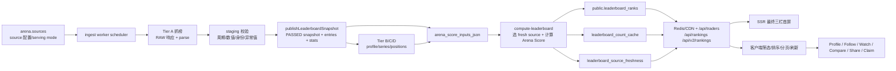

# ArenaFi 全量上线审计与用户路径 — 2026-07-18

> 范围：B2C 交易员发现、排行榜、关注/收藏/对比、认领、个人主页、社交、
> Onboarding、Pro 转化与核心市场页。本文区分“代码已修”“数据库已迁移”
> “生产已部署”“需要 owner”的状态，任何一层没完成都不写成已上线。

## 0. 结论与状态口径

优先级严格采用：

- **P0 致命**：崩溃、资金错误、数据丢失、核心功能完全不可用；上线前必须清零。
- **P1 重要**：明显影响主流程或信任，但有绕过路径；尽量在上线前修完。
- **P2 边缘**：小众路径、视觉小瑕疵或低概率依赖风险；明确排到上线后。

状态标记：

- ✅ **代码已修并推送**
- 🧪 **已验证**
- ⏳ **等待迁移/部署/生产实证**
- 👤 **需要 owner**
- ↪ **明确排到上线后**

当前软件分支已经完成的修复不能替代最后三道门：

1. 55 个 predeploy、2 个 postdeploy、5 个 concurrent recovery、3 个
   transactional recovery 必须在生产 exact ledger；当前已通过只读复核；
2. 最终应用必须持久进入 `main`，且生产健康端点返回该 release 的精确 SHA；
3. 生产浏览器和数据验收必须在同一个 SHA 开始并结束，owner 还须关闭外部
   合约与凭据 P0。

## 1. Bug 总表

### 1.1 P0 — 致命

| ID    | 触发与影响                                                                                                                                                                                 | 处理                                                                                                                                                                                                                                                                                                                                                | 当前状态                                                                                                                                                            |
| ----- | ------------------------------------------------------------------------------------------------------------------------------------------------------------------------------------------ | --------------------------------------------------------------------------------------------------------------------------------------------------------------------------------------------------------------------------------------------------------------------------------------------------------------------------------------------------- | ------------------------------------------------------------------------------------------------------------------------------------------------------------------- |
| P0-01 | Base 上已部署的 CopyTrading v1 存在 emergency exit 锁本金、任意 PnL、费用可抽本金、盈利无准备金、无全局 pause。用户绕过网页可直调合约。                                                    | 产品代码永久 fail-closed，不再返回/宣传 v1 地址；完整证据和 owner 操作写入 `COPY_TRADING_QUARANTINE.md`。owner 仍须执行 `setMaxFollowersPerTrader(0)`。                                                                                                                                                                                             | ✅网页隔离；👤区块 `48,813,425` 实时 getter 仍为 `100`。USDC/ETH 余额均 0，但这不代表合约安全。                                                                     |
| P0-02 | Following 只按 trader id 关联，跨交易所相同 id 可关注错账户或互相覆盖，属于用户关系数据错误。                                                                                              | 关注身份统一为 `(source, exchange_trader_id)`；API、客户端、计数、digest、activity、alert 与 DB composite identity 同步。                                                                                                                                                                                                                           | ✅代码；✅计数/activity predeploy；✅composite postdeploy exact；⏳source-aware 应用持久发布。                                                                      |
| P0-03 | Compare 把同名/同 id 的不同交易所账户折叠，URL、添加和删除可能指向错误账户。                                                                                                               | 对比身份改为精确交易所账户；API 返回缺失账户，客户端不再静默保留不存在的项目。                                                                                                                                                                                                                                                                      | ✅🧪；⏳生产。                                                                                                                                                      |
| P0-04 | 流式 not-found 页面 hydration 后错误移除 metadata DOM，可触发 `removeChild` 崩溃。                                                                                                         | 明确 metadata DOM ownership，防止客户端删除服务端拥有节点。                                                                                                                                                                                                                                                                                         | ✅🧪；⏳生产。                                                                                                                                                      |
| P0-05 | gTrade/Bitfinex 没有可证明的 ROI 排名基础却仍处于 serving 配置；一旦产生错误 rank 会污染公开榜单。                                                                                         | 保留采集为 active/shadow，但 fail-closed 禁止公开排名；migration 在发现真实 ROI 或公开 rank 时直接失败，避免静默覆盖真数据。                                                                                                                                                                                                                        | ✅🧪；✅生产 migration exact，DB 已 fail-closed；⏳source-aware 应用持久发布。                                                                                      |
| P0-06 | Stripe live 切换若仍保留来源不明的活跃订阅、漂移投影或旧 direct writer，会造成免费 Pro、重复购买、错误撤权或 webhook 模式错配。                                                            | 已有 `STRIPE_GO_LIVE.md` 严格 runbook；结账侧要求持久化 profile；数据库 readiness fail closed。最终撤销旧 RPC/封禁 direct DML 的 Stripe POSTDEPLOY 尚未实现。                                                                                                                                                                                       | 👤实时 readiness 为 `blocked`：2 个 manual review、2 个 projection drift、2 个 authority drift；`paidLaunchReady=false`。不阻塞免费排行榜，但真实收费必须保持关闭。 |
| P0-07 | 多个 Stripe handler 在 tip、订阅、invoice、退款写库失败后只 log/return，外层仍把事件标成成功并返回 200。真实触发可造成“已扣款但 tip 永久 pending / Pro 未授予或未撤销 / Stripe 不再重试”。 | 核心资金/权益写入失败、0 行 tip 更新、缺关键 checkout metadata、未知或 metadata 不匹配的 Price 全部 throw；事件记录 failed 并返回非 2xx。late cancellation 和非 lifetime refund 不再错误移除 lifetime/newer subscription 的官方群权益；invoice retry 即使 profile 已是 Pro 也继续修复 subscription row。只有通知、NFT、弃单分析是明确 best-effort。 | ✅代码（`fix(billing): retry incomplete webhook persistence`）；🧪Stripe 测试；⏳生产。                                                                             |
| P0-08 | 本轮本地诊断曾把生产数据库连接凭据带入进程列表输出；即使输出只在受控审计会话中，也必须按已暴露处理，不能沿用到正式上线。                                                                   | owner 在 Supabase 轮换数据库密码，更新本地/Vercel/worker secret，撤销旧凭据；再跑生产项目 attestation、迁移 status、schema/type 和健康检查。                                                                                                                                                                                                        | 👤未轮换；新增外部上线 P0。                                                                                                                                         |
| P0-09 | 最终 build 的一次只读进程诊断把继承环境中的 Alchemy/Brave API 凭据打印到受控工具输出；可能被滥用付费额度或耗尽生产配额。                                                                   | owner 轮换两个第三方凭据，更新 Vercel/worker/local secret，撤销旧值，并用不打印环境值的 canary 验证链上增强和搜索。                                                                                                                                                                                                                                 | 👤未轮换；按 secret exposure 处理，不在本文复述值。                                                                                                                 |

**P0 判定结论**：代码和生产 DB 迁移已修复或隔离已知网页资金/核心数据 P0，但当前
生产应用仍不是本分支的持久 release，不能写成“线上清零”。另外 P0-01 的公开合约仍可
被直调；owner 未把 cap 改为 0、P0-08/P0-09 未完成凭据轮换前，不能宣称“所有 P0
已清零”。也不能把“合约余额当前为 0”误写成“合约安全”。

### 1.2 P1 — 重要

| 领域              | 已确认问题                                                                                                                                                              | 修复/处置                                                                                                                                                 |
| ----------------- | ----------------------------------------------------------------------------------------------------------------------------------------------------------------------- | --------------------------------------------------------------------------------------------------------------------------------------------------------- |
| 首页首屏          | 慢网先显示单列，数秒后才变标准三栏，产生巨大布局位移。                                                                                                                  | 服务端直接输出最终三栏壳；客户端只接管交互，不重新发明布局；保留固定高度与列宽。✅                                                                        |
| 首页 freshness    | footer 用本地 2 小时推断，但数据来源契约是逐源 48 小时；指标不变时 fingerprint 会吞掉 freshness 更新。                                                                  | 从 SSR 到 footer 贯通 `isStale`；fingerprint 和跨标签广播包含来源水位；删除本地推断。✅                                                                   |
| 数据水位          | 旧 API 用全局 score compute time 冒充来源更新时间，无法指出 Binance/Bybit 等单源陈旧。                                                                                  | 新增逐 source/window 水位表；仅在无错误发布后前移；缺失、未来时间、失败批次均 fail-closed。✅代码；✅生产 migration；⏳持久应用 release                   |
| 重新打分          | 陈旧来源可能被重新打分、清零或参与清理，破坏 last-good 数据。                                                                                                           | stale source 不重新打分、不归零；清理只针对本轮 fresh source。✅                                                                                          |
| 组合榜            | null ROI/PnL 被转成 0、过期数据可覆盖 last-good、异常值混入 composite。                                                                                                 | 保留 null 语义，过滤无 score/ROI 和异常值，以来源水位决定是否替换。✅                                                                                     |
| Hero 事实         | “44 exchanges”及旧 exchange count 文案不真实；代码把 source board 当公司数。                                                                                            | 改为 live ranking source boards；API 保留 deprecated `exchangeCount` 但注释真实语义；RPC 用活跃榜源计数。✅代码；✅生产 migration；⏳持久应用 release     |
| 首页数据时间      | footer 显示计算时间而非真实采集时间。                                                                                                                                   | API、SSR、composite 全部使用来源 watermark，并显示 stale 状态。✅                                                                                         |
| 手机榜单卡        | 卡片内容横向溢出、按钮藏在卡外、嵌套交互区域误触。                                                                                                                      | 约束最小宽度/换行，动作按钮显式可见，移除嵌套 interactive。✅                                                                                             |
| Compare 缺失项    | API 静默丢弃不存在账户，用户以为全部已对比。                                                                                                                            | 返回 `missingAccounts`，UI 告知并规范化 URL，仅保存实际加载身份。✅                                                                                       |
| Claim 身份        | 认领跳转只带 handle，可能落到同名的其他交易所账户。                                                                                                                     | 全链路传递 source + exchange trader id。✅                                                                                                                |
| Claim 错误        | 搜索失败被渲染为空结果，用户无法区分“没有”与“请求失败”。                                                                                                                | 显式错误态和 retry；不清空已有结果。✅                                                                                                                    |
| Following 错误    | 刷新失败会清空列表，让用户误以为关注数据丢失。                                                                                                                          | 保留 last-good，展示错误和重试。✅                                                                                                                        |
| Compare discovery | 发现请求失败呈空状态。                                                                                                                                                  | 保留当前选择并展示错误/重试。✅                                                                                                                           |
| Watchlist         | 删除失败仍从 UI 消失。                                                                                                                                                  | 等服务器确认，失败保留并提示。✅                                                                                                                          |
| Portfolio         | 任一加载失败会覆盖已显示数据。                                                                                                                                          | last-good + 独立错误态。✅                                                                                                                                |
| Inbox 通知        | 加载错误显示为空通知。                                                                                                                                                  | 独立 loading/empty/error/retry。✅                                                                                                                        |
| Inbox 会话        | 加载错误显示为空会话。                                                                                                                                                  | 独立 loading/empty/error/retry。✅                                                                                                                        |
| Inbox 登录恢复    | auth 尚未恢复时先渲染未登录内容并跳动。                                                                                                                                 | 恢复完成前 gate 内容并保留布局。✅                                                                                                                        |
| Follow 登录恢复   | pending follow 在伪未登录瞬间被消费/丢失。                                                                                                                              | 只在确认 auth restore 后执行。✅                                                                                                                          |
| Follow 聚合       | 粉丝数、相似交易员、排行榜评分按 raw id 统计，会把不同交易所同 id 合并；fallback 还可能被 1,000 行上限截断。                                                            | 新 source/account RPC；reader 全部用 JSON tuple key；fallback 显式分页且部分页失败整批丢弃。✅代码/类型/生产 RPC                                          |
| Digest/Activity   | weekly digest、follow activity 和 trader event reference 按 raw id 关联，可能把另一个交易所账户的活动发给用户。                                                         | digest/follow/activity/alert 全部 source-scope；legacy null 只在唯一候选时兼容，否则跳过；同 raw id 双 source 回归已覆盖。✅                              |
| 迁移 runner       | 只看 version 数量、host 先查再执行，账本可在事务开始前漂移；重跑也可能把同名错误结构当成功。                                                                            | exact name/hash/body/idempotency；事务内重验并 `FOR SHARE` 锁行；missing 才执行；schema 提前存在时 fail closed。✅Node 10/10 + PG17                       |
| Onboarding        | 完成页跳转早于 follow intents 写完，选择的关注可能丢失。                                                                                                                | 跳转前 drain 全部 intent。✅                                                                                                                              |
| Search People     | API 有 public people，前端模型丢弃，People tab 假空。                                                                                                                   | 统一结果模型并展示公开用户。✅                                                                                                                            |
| Search retry      | 搜索失败只能改关键词，没有明确重试。                                                                                                                                    | 增加 retry，保留查询和结果。✅                                                                                                                            |
| Pricing 登录      | 未登录点购买，登录后 intent 丢失。                                                                                                                                      | 保存 plan/billing intent，登录后恢复。✅                                                                                                                  |
| Compare 登录      | 未登录进入已有对比集合后，登录会丢失 source/account 选择。                                                                                                              | 用 15 分钟、initiator-bound、一次性 session proof 恢复完整比较 intent；存储不可用时安全降级。✅                                                           |
| Bookmark 登录     | 未登录点收藏后只回原页，不会恢复精确 folder/action。                                                                                                                    | 保存精确 bookmark intent，登录后一次性消费；folder 加载失败显示重试，不伪装为空。✅                                                                       |
| Settings 路径     | 左侧 section 点击只改内存，刷新/分享 URL 会回默认页。                                                                                                                   | 所有 section 更新规范 `?section=`，保留其余参数和浏览器前进/后退语义。✅                                                                                  |
| Onboarding 身份   | auth 未稳定或账户切换时仍可能把完成状态写给错误 viewer；skip/update 失败仍跳首页。                                                                                      | flow 绑定当前 viewer/session；数据库必须确认同一账户 `completed=true` 才成功；pending 时禁用按钮。✅                                                      |
| Following 分页    | 两类 follow edge 受默认/单页上限截断；大量关注用户会漏账户。                                                                                                            | 两条 edge 均以 500 行分页取全，profile/rank 每 100 ID、最大并发 3，任一页失败整批 fail closed。✅                                                         |
| Groups 失败态     | joined/recommended/sidebar 三条请求失败会卡 skeleton 或显示假空。                                                                                                       | 三条 lane 独立 loading/error/retry；失败不覆盖其他已成功区域。✅                                                                                          |
| Inbox 部分失败    | DM、group 或 enrichment 任一失败时仍可能显示不完整会话为完整结果。                                                                                                      | direct/group 独立错误与重试；enrichment 缺口 fail closed，不伪装完整。✅                                                                                  |
| 排行失败态        | weekly/exchange 局部失败会让整页假空或覆盖已成功来源。                                                                                                                  | 区分 loading、真正空、全失败和部分失败；保留成功 exchange 结果并允许重试。✅                                                                              |
| Market/Flash      | overview、核心卡、Fear & Greed、套利、ticker、实时成交、spot/sector、快讯可能无限 loading 或把失败渲染为空。                                                            | 15 秒有界请求/连接；各 lane 的 pending/error/empty 分离；失败页不前移分页；全部可重试。✅                                                                 |
| Market 自选       | 手机 Market 显示 “Coming soon”，但真实 trader saved 已存在。                                                                                                            | 直接进入 `/saved?tab=traders`，删除假占位。✅                                                                                                             |
| Alert 管理        | 交易员铃铛只有单账户弹层，没有持久 Alerts 列表入口；Saved GET 失败显示“No alerts”。                                                                                     | 弹层保留配置/历史并增加 `/saved?tab=alerts` CTA；失败显示 ErrorMessage + Retry；登录保留 returnUrl。✅                                                    |
| Membership        | subscription/NFT/usage 任一失败会显示“免费方案 / 0 使用量”，误导已付费用户并诱导重复购买。                                                                              | 三项全部成功才渲染权益；非 2xx、畸形响应、网络失败统一 fail closed + Retry。✅                                                                            |
| 交易员手机详情    | 390px 下净值曲线 Fullscreen 右侧越界 33.2px，被祖先 `overflow:hidden` 裁掉。                                                                                            | 工具栏按空间自然换行；320/360/390/430px 等价生产 DOM 复核均为 0 越界。✅                                                                                  |
| Pro 手机横幅      | 四语长文案在窄屏被裁切/省略，CTA 与正文争空间。                                                                                                                         | 四语提供完整短文案并允许合理换行；不以 ellipsis 隐藏关键信息。✅                                                                                          |
| 表单遮挡          | 浮动 Feedback 会覆盖登录、注册或支付等关键表单动作。                                                                                                                    | 关键 auth/pricing 路径不挂载浮动反馈；普通页面仍保留入口。✅                                                                                              |
| 触控目标          | 排行周期/筛选等窄目标低于 WCAG 2.2 最低 24×24 CSS px。                                                                                                                  | 核心紧凑控件至少 24px；主要移动 CTA 继续使用 44px 级目标。✅                                                                                              |
| Wrapped           | 短暂数据故障直接 not-found。                                                                                                                                            | transient stall fail-soft，可重试；只有确定不存在才 404。✅                                                                                               |
| Funding/OI        | API 失败显示空表。                                                                                                                                                      | 明确 error/retry；保留可用数据。✅                                                                                                                        |
| Market hydration  | server/client 时区与 singleton 状态不同，产生 hydration mismatch。                                                                                                      | 统一时间源和初始状态。✅                                                                                                                                  |
| 页面遮挡          | Cookie、登录入口、行情链接、底部 FAB/导航互相覆盖或对比度不足。                                                                                                         | 统一 bottom safe-area offset、对比度和可点击语义。✅                                                                                                      |
| Similar traders   | DiceBear SVG 经 Next image optimizer 返回 400。                                                                                                                         | SVG avatar 绕过不支持的优化链。✅                                                                                                                         |
| 交易员周期        | Gate 等账号 30D 已无活动，页面却像正常有数据。                                                                                                                          | 当该周期所有已知活动指标均为 0 时展示 dormant notice。✅                                                                                                  |
| Serving QA        | 首页等待全局 `networkidle`，被持续请求拖成假超时。                                                                                                                      | 等可见榜单行并观察固定窗口，同时记录所有 `>=400` 响应。✅                                                                                                 |
| OKX Solana 增强   | 代表页 5/5 `POST /api/trader/onchain-enrich` 500；Helius `max usage reached`，Alchemy 月容量耗尽。核心 profile 约 765ms 可见，但可选链上 insight 不可用并制造重复 500。 | 容量错误现为可识别的 503 + `Retry-After`，有 5 分钟 circuit breaker 和显式非致命 UI；永久代码/DB 错误仍保持 500。✅代码；👤恢复增强功能仍需补供应商容量。 |
| Hot last-good     | SSR 帖子已显示后，hydration/定时刷新遇 500 会把 `{error}` 当空数组，清空整页并显示 noData。                                                                             | 非 2xx/畸形 2xx 进入显式错误，保留当前帖子并显示 Retry；只有成功合法空数组进入 noData；pull-to-refresh 改成原地请求。✅                                   |
| Tip 成功页        | `tips.post_id` 被误当成 group id；“Back to post”和分享都跳 `/groups/{postId}`。                                                                                         | 统一生成 `/post/{encodedPostId}`；没有 post id 时才返回 Groups。✅                                                                                        |
| Sentry sourcemap  | 生产构建若无 `SENTRY_AUTH_TOKEN`，错误只有压缩栈。                                                                                                                      | 必须由 Vercel 构建环境上传；独立 CI build 的 hash 不等于生产。👤                                                                                          |
| Auth 品牌         | Supabase 默认邮件模板/发件域会破坏首次注册体验。                                                                                                                        | Dashboard 配置和真实收件箱 canary。👤                                                                                                                     |
| 恢复能力          | 备份存在但没有 owner 参与的完整 restore drill。                                                                                                                         | 按 runbook 演练并记录 RTO/RPO。👤                                                                                                                         |
| Serving 覆盖      | 部署前生产只读覆盖仅 26/34 clean；8 个 source/window 有 stale 或 unresolved profile。                                                                                   | 最终 SHA 部署后串行重算 7D→30D→90D，再区分 score/cache 未刷新与真实上游陈旧；真实缺口保留告警，不篡改时间。⏳                                             |

### 1.3 P2 — 边缘，明确上线后

| 项                                                               | 为什么不是 P0/P1                                                                                                                   | 排期                                                |
| ---------------------------------------------------------------- | ---------------------------------------------------------------------------------------------------------------------------------- | --------------------------------------------------- |
| `@solana/web3.js → jayson → uuid@8.3.2` 3 个 moderate audit 告警 | 告警针对 UUID v3/v5/v6 buffer 参数；当前产品路径只用 `PublicKey` 校验，仓库未发现对应调用。npm 建议降到 `0.0.3` 是破坏性错误方案。 | ↪ 等上游升级，持续监控；不盲目降级。                |
| 少量 loading/视觉细节                                            | 不影响任务完成，且已有固定布局、错误态、焦点和对比度基线。                                                                         | ↪ 按真实 RUM/会话重放排序，不再凭截图无限扩 scope。 |
| 多语言独立 URL / hreflang                                        | 当前四语共用同 URL，影响 SEO 覆盖，不影响核心功能。                                                                                | ↪ 需要产品级 URL 决策。                             |
| Market trades 的 Node SSE fan-out                                | 已按视口建立/释放并限流；在当前流量可用。                                                                                          | ↪ 流量增长后改 worker→Redis snapshot→polling。      |
| BingX series coverage 为 0%                                      | 排名主记录仍可见；缺的是可选曲线深度，soft audit 只告警。                                                                          | ↪ 以真实适配器能力/backfill 修复，不生成伪曲线。    |
| ESLint 存量 2,781 warnings                                       | 最终 lint 为 0 error；警告大多是存量依赖数组、图片和类型风格，不直接阻断任务。                                                     | ↪ 建 warning ratchet，按模块逐步清零，禁止净新增。  |
| 可选钱包 SDK build warning                                       | production build 成功；来自依赖包的可选 Coinbase/MetaMask/Safe peer 路径。                                                         | ↪ 生产 DEX claim canary 后按真实触发路径升级依赖。  |

## 2. “44 个交易所”事实校正

仓库和生产数据里没有一个诚实口径能支持“44 个交易所已经拉进来”：

| 层                       | 当前口径 | 含义                                                                           |
| ------------------------ | -------: | ------------------------------------------------------------------------------ |
| `/api/platforms`         |       26 | 当前公开配置记录，含不同市场/产品板，不等于 26 家公司，也不等于都有公开排名。  |
| `arena.sources active`   |       34 | 当前启用采集的 source board。一个交易所可有 futures/spot/bot/web3 多个 board。 |
| exchange/protocol family |       19 | 当前 90D 可见来源合并同公司/协议后的家族数。                                   |
| 90D live scored boards   |       28 | 当前真正对 90D 公开榜单有有效 score input 的来源。                             |
| 90D 当前公开交易员       |    9,705 | 2026-07-18 production `get_hero_stats()` 实数；会随 cron 变化。                |

因此 UI 使用 **live ranking source boards**，不再写“44 exchanges”。以后新增来源必须同时
通过 RAW 证据、字段语义、排名资格、freshness 水位和公开页面验收，不能只加配置就计入宣传数字。

## 3. 核心数据流：用户看到的一行排名是怎样来的

关键不变量：

1. source 的原始抓取、解析和发布分层，抓取成功不等于可公开排名。
2. 只有 PASSED snapshot 才能进入 score input。
3. source 有错误或水位超过 48 小时时，保留 last-good，不把 ROI/PnL 归零。
4. source timestamp 超前超过 5 分钟直接拒绝，防止错误未来时间让数据“永久新鲜”。
5. source 级最旧有效时间决定该请求的 `lastUpdated/isStale`，不是 cron 自己的运行时间。
6. `source + exchange_trader_id` 是交易账户身份；handle 只是展示字段。
7. gTrade/Bitfinex 在没有真实 ROI basis 前只能 shadow，不能凭空进公开榜。

关键代码入口：

- `lib/ingest/serving/publish.ts`
- `app/api/cron/compute-leaderboard/phase1-select.ts`
- `app/api/cron/compute-leaderboard/fetch-phase1-arena.ts`
- `app/api/cron/compute-leaderboard/write-leaderboard.ts`
- `app/api/rankings/route.ts`
- `app/api/traders/route.ts`
- `lib/rankings/source-freshness.ts`

## 4. 用户核心流程与每个主要按钮

### 4.1 全局导航与入口

| 入口         | 点击结果                                                                          | 关键状态                                             |
| ------------ | --------------------------------------------------------------------------------- | ---------------------------------------------------- |
| Logo/Home    | `/` 排行榜发现页                                                                  | SSR 直接三栏；慢网不先变单列。                       |
| Rankings     | 榜单/交易所/Token 排名                                                            | 保留时间和过滤器 URL。                               |
| Market       | 市场总览；Funding、Open Interest、Arbitrage、Trades 子页                          | 请求失败显示 error/retry，不伪装空表。               |
| Groups       | 推荐/已加入/我管理的小组                                                          | 未登录动作进入登录并保留返回路径。                   |
| Hot/Feed     | 热门/关注流                                                                       | 帖子动作走服务器确认和回滚。                         |
| Me/头像      | 个人主页、User Center、Inbox、Claim、Referral、Portfolio、Saved、Settings、Logout | auth restore 期间不闪错误身份。                      |
| 全局 Search  | Traders / Posts / People / Groups                                                 | 每类独立 empty/error；People 使用真实 public users。 |
| 创建按钮/FAB | 创建帖子                                                                          | 与 cookie、bottom nav 使用统一 safe-area，不重叠。   |
| 顶栏通知铃铛 | Inbox 通知 tab                                                                    | 错误、空、未读分开。                                 |
| Trader Alert | 当前账户配置/历史弹层；“Manage all”进入 `/saved?tab=alerts`                       | 失败可重试；登录后回原交易员。                       |
| 语言/主题    | 中/英/日/韩；明/暗                                                                | hydration 使用稳定初始值。                           |

### 4.2 首页排行榜 `/`

| 控件/按钮                   | 行为                                                            |
| --------------------------- | --------------------------------------------------------------- |
| 90D / 30D / 7D              | 切换排名窗口；显示该窗口真实 source watermark。                 |
| All / Futures / Spot / Web3 | 切换市场类别；sticky filter 在分页、排序、刷新时不丢。          |
| Human / Bot                 | 交易员类型过滤。                                                |
| Advanced                    | 展开最小 Score、ROI、PnL、胜率、回撤等条件。                    |
| Style                       | Scalper / Swing / Trend / Position 等交易风格。                 |
| Search                      | 在当前过滤上下文搜索交易账户。                                  |
| Sort                        | Arena Score、ROI、PnL、胜率、回撤等；升/降序。                  |
| View/Density/Columns        | 表格或卡片、密度、显示列；手机卡不横溢。                        |
| Saved filter                | 保存/恢复筛选方案；Reset 恢复受支持默认值。                     |
| 行/卡片点击                 | 打开精确 source/account profile。                               |
| Follow                      | 登录后关注精确交易账户；pending intent 在 auth restore 后执行。 |
| Watch                       | 加入 watch/saved；失败不从 UI 假删除。                          |
| Compare                     | 加入对比浮条；精确身份去重。                                    |
| Share                       | X、Telegram、WhatsApp、系统 Share、复制链接、下载卡片。         |
| Export                      | 导出当前榜单视图；受 Pro/权限策略约束。                         |
| Load more                   | 保留当前过滤和排序追加；不回到 page 0。                         |
| Refresh/时间 footer         | 刷新榜单；来源 stale 时显示警告，失败保留 last-good。           |

### 4.3 交易员详情 `/trader/[handle]`

| 控件/按钮           | 行为                                                          |
| ------------------- | ------------------------------------------------------------- |
| Linked account tabs | 同一 claimed owner 的不同交易所账户切换，不按 handle 猜身份。 |
| 7D/30D/90D          | 切周期；全零活动周期显示 dormant notice。                     |
| Overview            | Score、收益、风险、曲线、来源质量、相似交易员。               |
| Stats               | 细分绩效与风险指标；未知值保持 null/`—`，不显示假 0。         |
| Portfolio           | 可用时显示持仓/资产；无数据与加载错误分开。                   |
| Posts               | claimed 用户的公开内容。                                      |
| Follow              | 关注当前精确账户。                                            |
| Watch               | 收藏当前账户。                                                |
| Alert               | 创建当前账户提醒、看历史；Manage all 进入持久 Alerts 列表。   |
| Compare             | 带当前精确身份进入 `/compare`。                               |
| Share               | 分享或下载当前资料卡。                                        |
| Claim               | 带 source + exchange trader id 进入认领。                     |
| Edit                | 仅 owner/已认领身份可进入主页编辑，不允许普通 viewer 越权。   |
| Similar trader      | 打开相似账户；SVG avatar 不再 400。                           |

### 4.4 Compare `/compare`

1. URL 可携带多个 `source:exchange_trader_id`。
2. Search/add 只加入 API 实际解析成功的账户。
3. 缺失账户展示 warning 并从 canonical URL 移除，不静默假装已比较。
4. 每列 Remove 删除精确身份。
5. 指标、雷达/曲线和 equity 使用同一账户顺序。
6. Followed picker 从当前用户真实关注列表添加。
7. Export/Share 输出当前有效比较集合。

### 4.5 Claim `/claim`

1. Search 输入 handle、账户 id 或平台线索。
2. 结果必须显示平台/source，点击后保存精确账户身份。
3. CEX：提交只读 API credential/平台证明；写权限 credential 必须拒绝。
4. DEX：连接钱包并签署 challenge，签名只证明地址所有权，不发送链上交易。
5. 无法自动证明时进入 manual review，显示 pending/approved/rejected 状态。
6. 搜索/提交失败是 error + retry，不渲染成“没有这个交易员”。
7. 成功后账户链接到用户身份，可设置 label、primary，并在公开主页展示。

### 4.6 个人主页 `/u/[handle]` 与主页编辑

| 控件                | 行为                                                     |
| ------------------- | -------------------------------------------------------- |
| Follow/Unfollow     | 用户社交关系；与交易账户 follow 分开。                   |
| Message             | 进入 direct conversation；权限受隐私设置约束。           |
| Followers/Following | 打开关系列表；隐私设置可隐藏。                           |
| Posts               | 用户发布内容。                                           |
| Stats/Portfolio     | owner 选择公开时展示关联交易表现。                       |
| Edit profile        | 只有当前 owner；头像/封面裁切、handle、bio，保存前校验。 |
| Linked traders      | 展示已认领账户、label 和 primary。                       |

### 4.7 Settings `/settings`

| Section/路径                | 主要动作                                                                 |
| --------------------------- | ------------------------------------------------------------------------ |
| `?section=profile`          | 修改 handle、bio、头像、封面；裁切、移除、保存/放弃。                    |
| `?section=security`         | 改邮箱/密码、重置码、2FA、passkey、查看/撤销 session。                   |
| `?section=wallet`           | 连接/断开钱包；签名类动作必须说明用途。                                  |
| `/settings/linked-accounts` | 管理 OAuth/social 登录连接，返回 Settings。                              |
| `?section=exchanges`        | 连接/同步/移除交易所 credential。                                        |
| `?section=trader-links`     | 认领/链接新交易账户、改 label、设 primary、unlink。                      |
| `?section=api-keys`         | 创建、一次性显示/复制、撤销 API key；升级套餐。                          |
| `?section=alerts`           | 管理 trader alerts，返回榜单发现账户。                                   |
| `?section=notifications`    | Follow/Like/Comment/Mention/Message/Trader event、digest、haptic。       |
| `?section=privacy`          | Followers/Following/Pro badge 可见性、DM 权限、解除 block。              |
| Referral card               | 查看/分享邀请进度。                                                      |
| `?section=account`          | 导出个人数据、Logout、Delete account 二次确认。                          |
| Sticky save bar             | 有未保存变化才出现；Discard 重载服务器真值，Save 写入当前 viewer scope。 |

### 4.8 Portfolio `/portfolio`

- 连接支持的交易所/钱包 credential。
- Sync 触发只读同步；显示 loading、部分成功、失败和 retry。
- Remove 必须服务器确认。
- Analytics、资产、positions 使用 last-good；单个来源失败不清空整页。
- 所有 API key 都应是只读最小权限，页面不得引导开启交易/提现权限。

### 4.9 Following、Saved、Watch

- `/following`：类别过滤、排序、打开 profile、unfollow、load more；失败保留列表。
- `/saved`：Traders / Posts / Alerts 三类；hydration 期间预留布局；每类失败有 retry。
- Watch/Unwatch：主页、榜单、详情共用同一服务器状态；remove 失败恢复并提示。
- Market 手机自选入口直接打开 `/saved?tab=traders`，不再显示假 “Coming soon”。

### 4.10 社交：Posts / Hot / Feed / Groups

| 对象        | 动作                                                                              |
| ----------- | --------------------------------------------------------------------------------- |
| Post        | Like/Downvote、Bookmark、Repost、Share、Report、Comment；owner 可 Edit/Delete。   |
| Comment     | Reply、Reaction、Report、Delete（有权限时）。                                     |
| Hot/Feed    | 排序/切流、打开详情；optimistic 状态失败必须 rollback。                           |
| Groups      | 搜索/推荐、Follow、Apply/Join、Leave、发帖、成员列表。                            |
| Group admin | 审核申请、成员角色/静音/移除、频道/小组设置、解散；必须 owner/admin fail-closed。 |

### 4.11 Inbox / Messages

- Notifications：类型过滤、标记已读、清空；加载失败有 retry。
- Conversations：direct/group 分类、搜索、创建 direct 或 group。
- Thread：发送文本/附件、reply、reaction、copy、delete、搜索、失败重试。
- auth restore 未完成时不显示“没有消息”或跳登录。

### 4.12 Onboarding 与 Pro

- Onboarding：语言、主题、兴趣、推荐交易员 follow、推荐小组 join、完成/skip。
- 完成前等待所有 follow/join intents；只有同一 viewer 的数据库确认成功才跳转。
- Pricing：monthly/yearly/lifetime 展示真实权益；未登录购买保存 intent。
- Membership：subscription/NFT/usage 失败时不猜“Free/0”，显示错误并重试。
- Checkout/Manage：只有明确套餐和持久化 billing profile 才进入 Stripe。
- `NEXT_PUBLIC_PRO_FREE_PROMO` 的 exact literal 决定 Preview/生产门禁，不能用模拟状态替代。

## 5. UI/UX 截图审计与设计原则

### 5.1 已修的视觉/交互问题

1. 首页 SSR 直接输出最终外层三栏与桌面七列榜单；同一 DOM 在手机重排成卡片，
   慢网不再先单列再跳标准布局。
2. 交易员手机卡约束内容宽度、数字换行和 action 区；净值曲线工具栏在窄屏换行，
   消除裁切/重叠。
3. Cookie banner、登录入口、FAB、底部导航共享 safe-area offset。
4. Legal/Market 链接提升对比度、焦点和语义。
5. Saved/Inbox/auth restore 使用固定占位，避免“空态闪一下再有数据”。
6. 错误态不再借用空态；核心列表型 fetch 保留 last-good + retry，权益类请求
   无法证明完整时 fail closed。
7. 时间 footer 区分“数据来源时间”和“本次刷新失败”。
8. Pro 横幅四语在窄屏使用完整短文案；Feedback 不覆盖关键 auth/pricing 表单。
9. Market/Flash 的 loading/error/empty/retry 使用统一状态语义，不以 skeleton 或
   “没有数据”掩盖网络失败。

### 5.2 采用的权威基线

- [WCAG 2.2](https://www.w3.org/TR/WCAG22/)：焦点、对比度、目标大小、状态可感知。
- [Apple HIG Design Principles](https://developer.apple.com/design/human-interface-guidelines/design-principles)
  与 [Layout](https://developer.apple.com/design/human-interface-guidelines/layout)：层级、清晰度、
  一致布局和触控安全区。
- [Apple HIG Loading](https://developer.apple.com/design/human-interface-guidelines/loading)
  与 [Feedback](https://developer.apple.com/design/human-interface-guidelines/feedback)：及时、诚实、
  不阻塞的状态反馈。
- [web.dev Optimize CLS](https://web.dev/articles/optimize-cls)：首屏预留最终空间，避免异步内容推挤。
- [TanStack Query Advanced SSR](https://tanstack.com/query/latest/docs/framework/react/guides/advanced-ssr)：
  SSR 数据与客户端缓存边界明确。
- [Playwright Page API](https://playwright.dev/docs/api/class-page)：等待可操作元素，
  不用全局 `networkidle` 代替产品 readiness。

这些原则用于修复现有 ArenaFi 结构，不引入一套与当前品牌不一致的新视觉系统。

### 5.3 截图证据

本轮截图保存在本机审计目录，不提交大体积生成物：

- `/tmp/arena-ui-audit/routes/`
- `/tmp/arena-ui-audit/routes2/`
- `/tmp/arena-ui-audit/home-slow4g-extended/`
- `/tmp/arena-trader-card-after-final.png`
- `/tmp/arena-home-mobile-after-card.png`
- `/tmp/arena-cookie-mobile.png`
- `/tmp/arena-cookie-landscape.png`
- `/tmp/arena-cookie-desktop.png`
- `/tmp/home-ssr-desktop.png`
- `/tmp/home-ssr-mobile-card.png`
- `/tmp/trader-equity-toolbar-baseline-390.png`
- `/tmp/trader-equity-toolbar-fixed-390.png`

最终部署后必须重新生成首页 desktop/mobile/slow-network 与代表 profile 的 after 截图；
旧生产截图只能作为 before 证据。

## 6. 仓库结构与清理

清理原则：只有“符号、完整路径、相对路径、动态注册、origin/main 均零引用”且没有人工运维
用途的文件才删除。不能仅凭“没有 import”删除可能被 cron/operator 直接调用的脚本。

已完成：

- 删除生成的 QA ledger、截图和临时产物，避免测试状态进入源码。
- 删除退休 batch fetch launchers，保留当前 worker/cron 主链。
- 删除 8 个从未接入当前首页的 legacy 组件/hooks（978 行）。
- 删除 `EmojiReactionBar.tsx` 和 `LinkPreviewCard.tsx` 两个从未接入的 post 组件（350 行）。
- 删除零引用、按 raw trader id 聚合的旧 `lib/services/trader-alerts.ts`（506 行）；
  真实 30 分钟 alert runner 保留并补 composite identity 回归。
- 删除旧版 Following 的 4 个零引用 UI/type 文件，并移除 Claim/Following/Trader
  中只为压制未使用变量保留的空参数/状态（500 行）。
- 退休 raw-id alert helper 后，broadcast/follow activity reference 和链接也改为 source-aware。
- 清理后做 orphan page 检查、TypeScript 和相关测试。

明确保留：

- `scripts/` 下可能由人工 runbook 调用的零入边 helper；仅凭静态图无法证明无用。
- 顶层 `script/` 是 Foundry 约定目录；`test/mocks/vercel-analytics.js` 被 Jest 使用；
  `workers/arena-score.ts` 被 cron inline job 使用；`.tsc-legacy-errors.txt` 是零豁免
  ratchet。它们都不是“看起来旧”就能删除的垃圾文件。
- `.next`、`.swc`、`test-results`、`playwright-report`、截图和 tsbuildinfo 是 ignored
  生成物，不进入源码提交。
- 原始工作树中用户尚未提交的 post hook、审计文档和 claim dry-run 临时文件；不覆盖、不混入本分支。

## 7. 迁移、部署与最终验收

### 7.1 迁移 phase 与 ledger

**本轮核心 Predeploy（应用代码开始读新契约前）：**

1. `20260717130000_hero_stats_count_live_source_boards.sql`
2. `20260718120000_leaderboard_source_freshness.sql`
3. `20260718123000_shadow_sources_without_roi_basis.sql`
4. `20260718130000_count_trader_account_followers.sql`
5. `20260718131000_source_scope_trader_follow_activity.sql`
6. `20260718183000_atomic_stripe_entitlement_identity.sql`
7. `20260718183500_harden_stripe_entitlement_null_validation.sql`
8. `20260718183600_fix_stripe_lifetime_duplicate_and_early_expiry.sql`
9. `20260718184000_arena_score_inputs_board_as_of.sql`

**Postdeploy（新 follow API 的精确 source 删除已经在生产 serving 后）：**

1. `20260717120000_trader_follows_composite_identity.sql`

follow composite 不能 predeploy：旧 API 的 unfollow 只按 raw trader id 删除；若先放开多 source
唯一约束，旧代码可能一次删掉多个交易所账户。短暂保留旧约束只会拒绝第二个同 id source，
不会造成关系数据误删。

必须使用 audited launch migration runner 的 outer transaction、ledger preflight 和 dry-run；
不能直接逐文件 `psql` 后假设 ledger 会自动正确。shadow migration 的 standalone
Repeatable Read 必须由 runner 在外层事务开始时建立，不能在 ledger 查询之后才设置隔离级别。
runner 当前 manifest 是 55 predeploy、2 postdeploy、5 concurrent recovery、
3 transactional recovery、1 superseded；恢复 prerequisite 固定为原始 41 项，
不能被后来追加的独立 launch migration 延迟。所有 exact skip 和 phase prerequisite
都在事务内重算 name/hash/body/idempotency，并锁住 ledger 行直到 COMMIT/ROLLBACK。

### 7.2 全量代码门禁

- `git diff --check`
- TypeScript
- ESLint
- 全量 Jest
- production build
- migration runner tests + `dry-run-all`
- serving data contract
- Playwright production suite（使用 `PLAYWRIGHT_BASE_URL`）

### 7.3 生产 hard gates

| Gate         | 验收                                                                                         |
| ------------ | -------------------------------------------------------------------------------------------- |
| SHA          | `/api/health.commit` 等于本次部署 commit。                                                   |
| DB ledger    | 五个新 predeploy 与 composite follow postdeploy 全部 exact；schema smoke 无复合键重复。      |
| Source truth | gTrade/Bitfinex 不再 serving；hero 显示 live source boards；freshness 表有 7D/30D/90D 水位。 |
| API          | `/api/traders`、`/api/rankings`、`/api/v2/rankings` 返回 source freshness，陈旧源可解释。    |
| SSR          | 首页慢网从 0ms 起保持最终三栏，无 hydration exception。                                      |
| Core UI      | 排行→详情→Follow/Watch/Compare/Share/Claim；Search；auth restore；error/retry。              |
| Browser      | 无核心 4xx/5xx、无 console exception、主要按钮可操作、desktop/mobile axe。                   |
| Copy v1      | 网页仍 fail-closed；owner cap getter 为 0 才能关闭外部 P0。                                  |
| Billing      | 免费产品可上线；真实收费必须另过 Stripe live runbook。                                       |
| Ops          | Sentry sourcemap、Auth 邮件 canary、restore drill 由 owner 留证。                            |

### 7.4 当前实证

- Branch：`codex/full-launch-ui-audit`；最终 release SHA 以本文档提交后的远端
  `main` 为准。最终代码与文档门禁基线为
  `f1cecfd9655348e5a4a0e5b535e2678f8d5e06cc`。
- Production commit：2026-07-18 22:50Z 的 `/api/health.commit` 仍为旧提交
  `ed2a31a7b2ca2051c1c85c486e271a4eeba3dc05`；DB/Redis 为 pass，但不是本轮
  最终 release。因此当前仍是⏳部署/持久 alias，不把 push 写成上线完成。
- Migration status：✅55/55 predeploy exact；✅2/2 postdeploy exact（既有
  social-edge + `20260717120000` composite identity）；5/5 concurrent recovery、
  3/3 transactional recovery exact；1 项明确 superseded。composite schema smoke：
  新约束存在、旧约束不存在、复合键重复组 `0`；仅保留 `2` 条无法安全解析的 legacy
  `source IS NULL` 关系。
- Production DB smoke：PostgREST `14.5`；freshness `84` 行；7D/30D/90D
  `board_as_of` 缺失均为 `0`；新 follower RPC 在
  anon/authenticated/service_role 均返回精确账户零计数；hero `28` live boards /
  `9,705` traders。
- Full Jest：✅787 suites、8,220 tests passed；2 suites / 17 tests 明确 skipped；
  0 failed。与 build/lint 并发时出现的 3 个超时/假失败在串行全量和独立套件均未复现。
- Stripe 最终追加切片：✅5 suites、154 tests；最终全量已包含这些用例。
- TypeScript/ESLint/build：✅type-check；✅lint 0 error（2,781 存量 warnings）；
  ✅父代码基线 `405583fed` 本地 production build 173/173 pages、BigInt 839 chunks；
  ⏳文档后的最终 SHA 由 Vercel production candidate 再做精确构建。
- Migration proofs：✅runner Node 13/13；✅完整 production `dry-run-all` rollback；
  ✅5 个相关 PG17 integration proofs。
- Serving QA：✅rank/cache 84/84 registry windows；coverage hard gate 仅 26/34 clean。
  `binance_futures`、`bybit_mt5`、`hyperliquid`、`mexc_futures`、
  `binance_web3_bsc`、`btcc_futures`、`xt_spot` 有 stale window，
  `bybit_copytrade` 有 99/100 unresolved profile；BingX 0% series 为 soft warning。
  ⏳最终 release 后串行重算并从头复验，不改写真实上游时间。
- Stripe readiness：`healthy=false`、`paidLaunchReady=false`；九键 exact，
  open manual review/projection drift/authority drift 分别为 `2/2/2`。
- Browser QA：⏳最终生产 desktop/mobile/axe/button/core-flow。
- Slow-network first paint：✅本地最终三栏壳与截图；⏳最终生产 slow-network 复验。
- Open owner gates：**P0** CopyTrading v1 cap `100 → 0`、**P0** 生产 DB 密码轮换、
  **P0** Alchemy/Brave 凭据轮换；
  Stripe live、OKX provider 容量、Sentry sourcemap、Auth 邮件 canary、restore drill。
